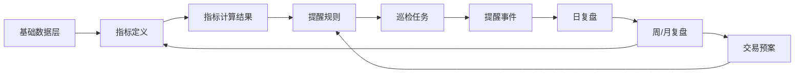

# 21 — 自定义指标、提醒规则与交易预案设计

> 创建于 2026-06-03。本文定义 Invest Agent 后续如何支持“客户自定义指标 + 基于指标的巡检提醒 + 交易预案引用指标”。目标是先形成可执行设计，后续按阶段实现，不急着开放客户通过 AI 自助编写指标。

## 背景

当前系统已经有三类相关能力：

- `stock_plans`：交易预案，包含支撑位、压力位、目标位、止损位和备注。
- `alerts`：提醒规则，按股票、指标和阈值触发。
- `signal_config`：系统信号配置，存放默认信号开关和参数。

问题是这三者现在边界不够清晰：

- 交易预案偏价格参数，容易写死。
- 提醒规则直接存 `indicator + threshold`，缺少指标定义层。
- 系统信号是全局配置，客户定制指标还没有独立模型。
- 巡检可以触发一些技术/价格/资金流信号，但难以表达客户自己在通达信等软件里常用的复合指标。

用户真正需要的是：客户有自己的指标体系，系统能承载这些指标，并按指标稳定巡检、提醒和复盘。

## 核心定义

### 基础数据

基础数据是指标计算的输入。

包括：

- 日 K。
- 分钟 K / 分时 K。
- 成交量、成交额、换手率。
- 均线、MACD、量比、振幅等可派生技术指标。
- 筹码分布、成本区间、股东人数等后续可选数据。
- 逐笔成交、盘口、Level-2 等后续增强数据。

### 指标定义

指标定义说明“怎么算”。

示例：

```text
指标：缩量横盘
周期：日线
公式：近 10 日成交量均值 < 20 日成交量均值 * 0.7，并且近 10 日振幅 < 6%
输出：true/false + 解释
```

指标本身不决定是否提醒，也不等于交易建议。

### 提醒规则

提醒规则说明“什么时候提醒”。

示例：

```text
股票：紫金矿业
指标：缩量横盘
条件：result == true
频率：每日收盘后
去重：同一状态持续时不重复提醒
```

提醒规则引用指标定义，并指定股票、参数、阈值、频率和去重策略。

### 交易预案

交易预案说明“这只股票的决策计划”。

示例：

```text
紫金矿业：
- 28-31 元是观察区。
- 若出现缩量横盘 + 铜价企稳，可小额试探。
- 若跌破 28 且放量下杀，暂停加仓。
- 关注指标：缩量横盘、放量跌破、主力控盘迹象。
```

交易预案可以引用指标和提醒规则，但预案不是指标，也不是提醒规则。

## 总体模型



一句话：

> 指标负责计算，提醒规则负责触发，交易预案负责解释和行动边界，巡检负责执行，复盘负责验证。

## 与当前系统的关系

| 当前概念 | 后续定位 | 是否保留 |
| --- | --- | --- |
| `signal_config` | 系统内置指标/信号的全局开关与默认参数 | 保留，逐步迁移为指标定义的一部分 |
| `alerts` | 股票级提醒规则 | 保留，但字段要升级为引用指标定义 |
| `stock_plans` | 股票级交易预案 | 保留，但增加指标引用和结构化条件 |
| `alert_events` | 巡检触发后的事件记录 | 保留，增加指标计算快照 |
| `alert_signal_states` | 状态型提醒去重 | 保留，扩展到自定义指标 |

## 数据模型设计

### indicator_definitions

指标定义表。用于存内置指标和客户定制指标。

```sql
CREATE TABLE indicator_definitions (
  id INTEGER PRIMARY KEY AUTOINCREMENT,
  key TEXT NOT NULL UNIQUE,
  name TEXT NOT NULL,
  category TEXT NOT NULL,
  scope TEXT NOT NULL DEFAULT 'stock',
  timeframe TEXT NOT NULL,
  formula_type TEXT NOT NULL,
  formula TEXT NOT NULL,
  params_schema TEXT NOT NULL DEFAULT '{}',
  output_schema TEXT NOT NULL DEFAULT '{}',
  data_requirements TEXT NOT NULL DEFAULT '[]',
  reliability TEXT NOT NULL DEFAULT 'stable',
  enabled INTEGER NOT NULL DEFAULT 1,
  owner TEXT NOT NULL DEFAULT 'system',
  description TEXT,
  created_at TEXT NOT NULL,
  updated_at TEXT NOT NULL
);
```

字段说明：

| 字段 | 说明 |
| --- | --- |
| `key` | 程序化标识，例如 `volume_contraction_range` |
| `category` | `price` / `volume` / `trend` / `chip` / `tick` / `custom` |
| `timeframe` | `1m` / `5m` / `daily` / `weekly` |
| `formula_type` | `builtin` / `expression` / `script` / `manual_spec` |
| `formula` | 内置函数名、表达式或人工规格 |
| `params_schema` | 参数定义 |
| `data_requirements` | 需要哪些数据 |
| `reliability` | `stable` / `experimental` / `manual_review` |
| `owner` | `system` / `customer` / `ai_draft` |

### indicator_results

指标计算结果表。用于审计、复盘和调试。

```sql
CREATE TABLE indicator_results (
  id INTEGER PRIMARY KEY AUTOINCREMENT,
  indicator_key TEXT NOT NULL,
  stock_code TEXT NOT NULL,
  stock_name TEXT NOT NULL,
  timeframe TEXT NOT NULL,
  calculated_at TEXT NOT NULL,
  data_time TEXT NOT NULL,
  value TEXT NOT NULL,
  level TEXT,
  confidence TEXT,
  explanation TEXT,
  source_snapshot TEXT NOT NULL DEFAULT '{}',
  missing_data TEXT NOT NULL DEFAULT '[]'
);
```

### alert_rules

长期建议用新表替代或升级当前 `alerts`。

```sql
CREATE TABLE alert_rules (
  id INTEGER PRIMARY KEY AUTOINCREMENT,
  stock_code TEXT NOT NULL,
  stock_name TEXT NOT NULL,
  indicator_key TEXT NOT NULL,
  condition TEXT NOT NULL,
  params TEXT NOT NULL DEFAULT '{}',
  schedule TEXT NOT NULL DEFAULT 'intraday',
  dedupe_policy TEXT NOT NULL DEFAULT '{}',
  severity TEXT NOT NULL DEFAULT 'medium',
  relation_to_plan TEXT,
  enabled INTEGER NOT NULL DEFAULT 1,
  created_at TEXT NOT NULL,
  updated_at TEXT NOT NULL
);
```

提醒规则例子：

```json
{
  "indicator_key": "volume_contraction_range",
  "condition": "value.triggered == true",
  "params": {
    "lookbackDays": 10,
    "volumeRatio": 0.7,
    "maxAmplitudePercent": 6
  },
  "schedule": "after_close",
  "dedupe_policy": {
    "type": "state",
    "cooldownMinutes": 1440
  }
}
```

### stock_plans 扩展

短期可以继续保留现有字段，再增加 JSON 字段：

```sql
ALTER TABLE stock_plans ADD COLUMN watch_conditions TEXT;
ALTER TABLE stock_plans ADD COLUMN linked_alert_rule_ids TEXT;
ALTER TABLE stock_plans ADD COLUMN plan_type TEXT DEFAULT 'manual';
```

`watch_conditions` 示例：

```json
[
  {
    "label": "观察低吸",
    "indicatorKey": "volume_contraction_range",
    "condition": "triggered == true",
    "actionHint": "只允许小额试探，不追高"
  },
  {
    "label": "暂停加仓",
    "indicatorKey": "break_support_with_volume",
    "condition": "triggered == true",
    "actionHint": "先停止加仓，等待复盘确认"
  }
]
```

## 指标表达方式

### 阶段一：内置函数 + 参数

第一阶段不要开放任意脚本。用内置函数承载指标，客户或我们只配置参数。

示例：

```json
{
  "key": "volume_contraction_range",
  "formula_type": "builtin",
  "formula": "volumeContractionRange",
  "params": {
    "lookbackDays": 10,
    "compareDays": 20,
    "volumeRatio": 0.7,
    "maxAmplitudePercent": 6
  }
}
```

优点：

- 稳定。
- 安全。
- 容易测试。
- 不需要让客户理解代码。

### 阶段二：安全表达式 DSL

后续可以支持有限表达式：

```text
ma(volume, 10) < ma(volume, 20) * 0.7
and amplitude(high, low, 10) < 6
and close > ma(close, 20)
```

必须限制：

- 只允许白名单函数。
- 只允许读取市场数据。
- 不允许文件、网络、系统命令。
- 每个表达式必须可静态校验。

### 阶段三：AI 辅助转译

等模型稳定后，可以让 AI 把客户自然语言或通达信公式转成内部 DSL，但必须人工确认。

流程：

```text
客户提供公式/截图/自然语言
-> AI 解释公式含义
-> 转为内部指标草案
-> 展示参数和数据需求
-> 用户确认
-> 保存为 indicator_definition
```

当前阶段不开放这一步，只预留模型。

## 基础数据层优先级

第一阶段先覆盖这些稳定数据：

| 数据 | 用途 | 状态 |
| --- | --- | --- |
| 日 K | 趋势、均线、振幅、支撑压力、缩量 | 已有 |
| 分钟 K | 分时量价、盘中放量、VWAP、尾盘异动 | 部分已有/需整理 |
| 实时行情 | 价格、涨跌幅、成交量 | 已有 |
| 换手率 | 缩量、筹码交换速度 | 需确认当前行情源字段 |
| MACD/均线/量能 | 技术面基础指标 | 已有部分 |
| 筹码分布 | 成本集中度、获利比例 | 待接入 |
| 逐笔成交 | 大单主动买卖、盘中行为 | 后续增强 |
| Level-2 盘口 | 压单、托单、委托队列 | 后续增强 |

## 初始内置指标建议

第一批应覆盖客户最可能使用、且能用现有数据计算的指标。

| 指标 | 数据需求 | 输出 | 用途 |
| --- | --- | --- | --- |
| 接近预案支撑位 | 实时价 + stock_plans | true/false | 低吸观察 |
| 跌破预案止损位 | 实时价 + stock_plans | true/false | 风险提醒 |
| 放量突破压力位 | 实时价 + K 线成交量 + stock_plans | true/false | 突破确认 |
| 缩量横盘 | 日 K 成交量 + 振幅 | true/false | 控盘/蓄势代理 |
| 缩量回踩 | 日 K + 均线/支撑 | true/false | 回踩观察 |
| 放量下杀 | 日 K/分钟 K | true/false | 风险提示 |
| MACD 金叉/死叉 | 日 K | signal | 趋势辅助 |
| 分时放量滞涨 | 分钟 K | true/false | 盘中异常 |
| 主力控盘迹象代理 | 日 K + 分钟 K + 可选筹码 | score | 只作最后一节观察 |

## 巡检执行模型

### 计算流程

```text
读取启用的 alert_rules
-> 按股票聚合数据需求
-> 拉取基础数据
-> 计算 indicator_results
-> 判断 alert_rules.condition
-> 应用 dedupe_policy
-> 写入 alert_events
-> 必要时推送微信
```

### 去重策略

支持三种：

| 类型 | 适用场景 |
| --- | --- |
| `cooldown` | 价格异动、放量等短期事件 |
| `state` | 跌破止损、跌破支撑、缩量横盘持续状态 |
| `once_per_day` | 收盘后指标 |

状态型规则必须在状态解除后才允许再次提醒。

## Dashboard 设计方向

后续 Dashboard 应有三个入口。

### 指标库

展示：

- 指标名称。
- 分类。
- 周期。
- 数据需求。
- 稳定性。
- 是否启用。

操作：

- 查看说明。
- 修改参数。
- 启用/停用。
- 后续支持新增客户指标草案。

### 提醒规则

展示：

- 股票。
- 指标。
- 条件。
- 频率。
- 去重。
- 关联预案。
- 最近触发。

操作：

- 新增/编辑/停用规则。
- 从交易预案生成提醒规则。

### 交易预案

展示：

- 股票。
- 价格参数。
- 观察条件。
- 关联指标。
- 关联提醒规则。
- 最近复盘结论。

操作：

- 编辑预案。
- 选择关注指标。
- 一键生成提醒规则。

## 微信/AI 交互边界

当前阶段：

- AI 可以解释已有指标。
- AI 可以根据客户自然语言建议“可以配置哪些指标提醒”。
- AI 可以帮助把客户交易预案整理成结构化草案。
- AI 不直接保存复杂自定义指标公式，除非用户明确确认。

不做：

- 不让客户直接通过一句话创建任意可执行脚本。
- 不让 AI 编造数据字段。
- 不把无法计算的指标写入巡检。

推荐话术：

```text
这个预案里有两个可以转成巡检的条件：
1. 跌破 28 且放量：可以设置为风险提醒。
2. 28-31 区间缩量横盘：可以设置为观察提醒。

我可以先按系统内置指标生成提醒规则，后续如果你有自己的公式，再把公式转成自定义指标。
```

## 复盘闭环

日复盘要记录：

- 哪些指标触发。
- 触发时的价格和数据快照。
- 是否符合交易预案。
- 后续是否命中、误报、待验证。

周/月复盘要统计：

- 指标触发次数。
- 命中率。
- 误报率。
- 漏报案例。
- 哪些指标应该调参、停用或升级数据源。

这部分是指标体系真正变好的关键。

## 分阶段实施计划

### P0：概念和文档固化

- 完成本文档。
- 更新路线图。
- 后续开发都按“指标定义 / 提醒规则 / 交易预案”三层来拆。

### P1：指标定义表和内置指标迁移

- 新增 `indicator_definitions`。
- 把现有 `signal_config` 的默认信号转成内置指标定义。
- 保留兼容读取，避免一次性迁移风险。

当前状态（2026-06-03）：

- 已新增 `indicator_definitions`、`indicator_results`、`alert_rules` 表结构。
- 已为 `stock_plans` 增加 `watch_conditions`、`linked_alert_rule_ids`、`plan_type` 扩展字段。
- 已新增内置指标定义初始化逻辑。
- 已新增 `/api/indicators` 和 `/api/indicators/:key` 只读接口。
- `/api/dashboard` 已输出 `indicators`、`upgradedAlertRules`、`recentIndicatorResults`。
- 旧 `signal_config`、`alerts` 和巡检主流程仍保持兼容，尚未切换到新 `alert_rules`。

### P2：提醒规则升级

- 新增 `alert_rules` 或扩展 `alerts`。
- 让提醒规则引用 `indicator_key`。
- 增加 `schedule`、`dedupe_policy`、`params`。
- 巡检引擎按新规则执行。

当前状态（2026-06-03）：

- 新增旧提醒到新版 `alert_rules` 的镜像同步逻辑。
- `/api/alerts/set`、`/api/alerts/toggle`、`/api/alerts/remove` 会同步新版规则。
- 旧 `handleAlertTool` / `handleAlert` 设置或关闭提醒时会同步新版规则。
- 服务启动时会把历史 `alerts` 同步到 `alert_rules`。
- 已新增 `custom_target_price`、`custom_support_price` 指标定义，用于承接旧目标价/支撑价提醒。
- 巡检引擎暂未切换到 `alert_rules`；当前仍由旧 `alerts` 和 `signal_config` 驱动，避免破坏现有提醒稳定性。

### P3：交易预案引用指标

- 扩展 `stock_plans`。
- 支持预案里的观察条件引用指标。
- Dashboard 上支持从预案生成提醒规则。

当前状态（2026-06-03）：

- `/api/plans/set` 已支持 `watchConditions`、`linkedAlertRuleIds`、`planType` 字段。
- 新增 `/api/plans/watch-conditions`，可为股票保存结构化观察条件。
- 观察条件可引用 `indicatorKey`，并可设置 `createAlertRule=true` 自动生成新版 `alert_rules`。
- 生成的规则会标记 `relation_to_plan=stock_plan_watch_condition`，用于后续巡检和复盘追溯。
- 当前仍未把新版 `alert_rules` 接入巡检执行，只完成交易预案到指标规则的结构化桥接。

### P4：指标结果审计

- 新增 `indicator_results`。
- 每次巡检保存指标计算快照。
- 日复盘引用该快照，而不是重新解释。

当前状态（2026-06-03）：

- 旧巡检触发提醒并写入 `alert_events` 时，会同步写入 `indicator_results` 快照。
- 快照包含 `indicator_key`、股票、时间、触发值、级别、置信度、解释、预案关系和缺失数据说明。
- 当前只保存“实际入库并推送候选”的触发结果；被状态去重/冷却过滤掉的重复提醒不会重复写快照。
- 日复盘尚未读取 `indicator_results`，下一步可把当日指标快照纳入复盘上下文。

### P5：客户指标草案

- 支持人工录入客户指标。
- 先用 `manual_spec` 保存，不执行。
- 我们确认公式和数据需求后，再转为 `builtin` 或 DSL。

### P6：安全 DSL / AI 辅助转译

- 建立白名单函数。
- 支持有限表达式。
- AI 可生成草案，但必须用户确认。

## 验收标准

第一阶段可验收：

- 能清楚区分指标、提醒规则和交易预案。
- 一个指标可以被多个股票提醒规则复用。
- 一个交易预案可以关联多个提醒规则。
- 巡检事件能回溯到具体指标定义、参数和数据快照。
- 日复盘能评价指标是否有效，而不只评价股票涨跌。
- 没有可靠数据时，系统不会把指标写成确定结论。

## 风险与注意事项

| 风险 | 处理 |
| --- | --- |
| 指标过多导致客户困惑 | Dashboard 先分“系统内置”和“客户定制”，默认只显示启用项 |
| AI 误把自然语言变成错误公式 | 所有客户指标先保存为草案，人工确认后执行 |
| 数据源不稳定 | 每个指标声明 data_requirements 和 reliability |
| 巡检重复提醒 | 所有规则必须配置 dedupe_policy |
| 交易预案和提醒规则脱节 | 预案里显示关联提醒规则和最近触发 |
| 指标被误当成买卖建议 | 输出始终区分“指标触发”和“操作建议” |

## 最终建议

下一步不急着做客户自助指标编辑器。更稳的推进方式是：

1. 先建立指标定义和提醒规则的新模型。
2. 把现有系统信号迁移成内置指标。
3. 让交易预案能引用指标。
4. 让巡检事件保存指标计算快照。
5. 再根据客户实际给出的通达信公式或指标截图，逐个转成可计算的客户指标。

这样既能满足定制化客户的长期需求，也不会让当前 MVP 被复杂公式系统拖垮。
