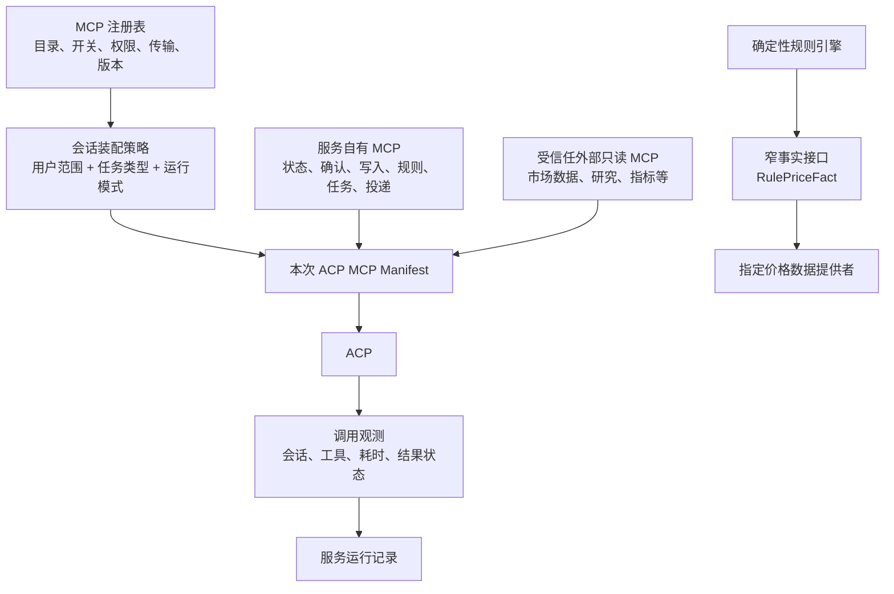

# 数据源架构讨论笔记

> 状态：核心方向已收敛；实施拆分见 [MCP 注册与 Agent 工具架构重构计划](./mcp-registry-and-agent-tooling-refactor-plan.md)。在对应工作包完成前，本笔记本身不替代现行运行契约。
>
> 目的：记录数据源架构重梳过程中的重要判断。只记录已形成的方向和待决问题，不作为实施计划。

## 当前共识

### 1. 先按消费者分层，而不是按数据格式分层

市场数据有三类不同消费者，不能要求它们共用一套输入输出契约：

| 消费者 | 职责 | 数据契约要求 |
| --- | --- | --- |
| ACP 开放式对话、研究和分析 | 自主调用工具、综合信息并回答用户 | 工具可直接返回列式 JSON、文本或表格；AI 可自行理解，不要求本项目预先归一化 |
| ACP 驱动的定时复盘、盯盘简报、日报 | 定时接收任务，取数、分析并决定生成简报或 `NO_PUSH` | 与开放式对话相同；结果格式不是系统架构约束 |
| 服务层确定性规则触发 | 根据明确条件判定是否触发，并处理去重、冷却和投递 | 必须使用窄、稳定、可校验的事实契约 |

因此，不能因为规则引擎需要结构化价格事实，就要求 ACP 的所有研究数据也走相同的服务标准化流程。

### 2. `market-data-tool` 的直接 MCP 价值在 ACP 推理层

`market-data-tool` 可作为 ACP 的数据获取工具。它的列式结果、工具名和供应商细节对于 AI 推理不是阻碍；不应仅为让 AI 读取而在 Invest Agent 内复制一套字段映射、数据源封装或通用代理。

这不等同于它自动替换确定性规则所需的数据接口。后者必须独立评估。

### 3. 定时“盯盘”与确定性规则是两件事

`market-watch` 类任务的合理模型是：服务 scheduler 负责定时、范围、任务状态、失败重试、频控和实际投递；ACP 负责获取开放数据、依据用户方法论分析，并产出简报或 `NO_PUSH`。

`rule-alert-check` 类任务才是确定性系统：服务读取明确事实、执行条件、记录事件、处理 dedupe/cooldown，并决定是否投递。它不能依赖模型临时解释数据或承诺覆盖所有盘中瞬间。

### 4. 面向客户的 Agent 推送不以“保存原始数据证据”为目标

对客户而言，推送或对话中的链接和最终内容已足够支持后续查阅。当前讨论方向不要求 Invest Agent 为每次 ACP 研究、复盘或推送额外持久化原始数据、来源时间线或 provider 遥测，以便事后重放投资判断。

数据工具自身负责其数据源、缓存、时间与降级细节。是否保留服务运行所必需的任务状态、投递记录与安全审计，仍属于独立的服务运行问题，不能由本条直接推导为删除。

### 5. 确定性规则只需要很窄的价格事实能力

规则引擎不应依赖完整的通用市场数据服务。它只需要专门定义并校验的事实，例如：

```ts
type RulePriceFact = {
  code: string;
  price: number;
  asOf: string;
  usable: boolean;
};
```

具体字段仍待讨论，但目标是只覆盖阈值判断所必需的信息；无效、缺失或过期数据不得触发规则。交易日、调度采样、去重、冷却和推送由服务层继续负责。

规则执行时应只传入已经确认的证券代码。证券名称是用户交互和展示字段，可能歧义；名称到代码的解析应发生在创建或修改规则时，并把最终代码写入规则。每次 scheduler tick 不应重新进行名称模糊匹配。

当前讨论的最小实现可以是一个不经 ACP 的服务内部批量接口：

```ts
getRulePrices(codes: string[]): Promise<Map<string, RulePriceFact>>
```

它一次读取本轮所有启用规则涉及的代码，先请求腾讯行情；主源失败或特定代码无有效价格时，再请求一个明确的 fallback。只有有限且非空的价格才返回 `usable: true`，其他情况返回不可用而不触发规则。规则引擎随后只做阈值比较、事件去重、冷却和投递。

这条路径不需要完整 `marketDataReadCapability`、市场快照、新闻、K 线、来源报告或 MCP 字段转换。短 TTL 缓存和批量请求可由该小接口自行处理，以避免同一 scheduler tick 按规则重复访问上游。

### 6. 服务层应成为 MCP 注册与组装控制面

当前 Codex ACP 的 MCP 配置由 `src/acp/stdio-agent.ts` 中的
`buildInvestAgentMcpServers()` 硬编码生成。它目前只注册一个
`invest-agent-service-tools` stdio MCP；外部 MCP 不能直接进入 ACP 的工具列表。

讨论方向是保留服务层对 ACP 工具配置的控制，但把它从“所有数据调用的转换代理”改为“MCP 注册与组装控制面”：

- 服务层为每个 ACP 会话按任务、用户范围和运行模式组装允许的 MCP 列表；
- 服务自有 MCP 继续承载用户状态、确认、写入、规则、任务状态和投递等受控能力；
- 受信任的外部只读数据 MCP 可作为独立工具注册给 ACP，ACP 直接调用；
- 注册表而非 Workspace 提示词决定哪些服务器、版本、传输方式、凭据和任务上下文可用；
- 不增加“任意 MCP/HTTP 代理”工具，也不把外部工具的所有响应强制转换成服务领域对象。

这样既保留了工具接入的治理点，也避免让开放式研究数据绕行不必要的服务适配层。

#### 注册的对象是 MCP 服务器，不是其每一个工具

对于经过批准的外部只读数据工具，服务层应注册整个 MCP 服务器。会话装配后，ACP 直接与该服务器完成 MCP 握手和 `tools/list`，使用该服务器在本次会话实际声明的工具；服务层不为每个外部工具写同名 wrapper、字段映射或调用分支。

这使外部数据工具可以自行演进：新增行情、财报、新闻、筛选或研究工具时，在其服务端完成发布，新的 ACP 会话即可发现。服务层可为 Platform/运维缓存一份已发现的工具目录用于展示和健康诊断，但该缓存不是 ACP 的第二份工具真相。

注册表对外部 MCP 的最小记录应是服务器级信息：稳定 ID、所有者/来源、传输配置、凭据引用、批准版本或版本范围、信任类别、全局启停状态，以及适用的 ACP 会话类型。

“信任服务器”仍需有清晰边界：

- `market-data-tool` 这类已批准为只读数据服务器的 MCP，可允许其在约定的只读能力范围内自行扩展；
- 服务不得因外部服务器新增写入、付费、高频、敏感文件或跨用户访问能力而自动放开相应权限；这类能力需要新的注册策略或人工重新批准；
- 多个 MCP 同时装配时必须处理工具名称冲突。优先使用客户端支持的服务器命名空间；若不支持，注册时要求外部工具名全局唯一，不能悄然覆盖服务自有工具；
- 外部 MCP 不获得 Invest Agent 的 Workspace、数据库、sandbox token 或服务写入凭据。它只收到其自身运行所需的最小配置。

因此，服务层的职责是“批准一个可演进的工具服务器并把它装配给 ACP”，不是“冻结并重实现该服务器当前的工具列表”。

### 7. 目标图景：服务层管理 MCP 能力目录、装配与观测

讨论中的目标不是让外部 MCP 绕过服务治理，而是由服务层持有 MCP 注册表，并在每次 ACP 会话启动时生成受控的工具清单。



注册表建议区分三个概念，避免把“目录”“启用”和“本次实际可用”混为一张表：

| 概念 | 责任 | 典型内容 |
| --- | --- | --- |
| MCP 目录 | 服务认可哪些 MCP 可被接入 | ID、类型（服务自有/外部）、传输（stdio/HTTP）、版本、凭据引用、信任等级、全局启停状态 |
| 装配策略 | 哪些已批准 MCP 可以进入某类 ACP 会话 | 默认启用的只读数据工具、服务自有受控工具，以及只在权限/隔离场景使用的硬限制 |
| 会话 Manifest | 一次 ACP 会话实际收到的 MCP 列表 | 由前两项在会话开始时解析生成；运行中的开关变更通常在下个会话生效 |

外部 MCP 的注册信息不能保存明文凭据；只保存服务环境或 secret store 的引用。外部 MCP 默认应是只读、无 Workspace/数据库凭据、无任意本地文件权限的工具。涉及用户状态或任何写入的能力仍必须是服务自有 MCP 工具。

#### 装配策略不是工作流工具编排

对于开放式对话、复盘、盘中简报和日报，默认方向是把**全部已启用且只读的 MCP** 提供给 ACP。服务层不应预先规定“复盘只能调用哪些行情、新闻或研究工具”；Agent 根据用户问题、当时数据缺口和自身判断选择调用顺序。

例如到日复盘时间时，scheduler 只负责创建带有用户范围的 ACP 任务；ACP 自行读取持仓/计划等服务状态，自主调用已启用的数据工具，完成分析后调用受控的报告保存或投递能力。服务层不承担“先查行情、再查新闻、最后写报告”的流程编排。

硬限制只保留给以下情况：

- 写入、确认、投递、规则修改等有副作用的服务能力；
- 跨用户、跨 Workspace 或需要敏感凭据的能力；
- 费用高、配额稀缺或有明确运营风险的外部工具；
- 专门的隔离探针、验收或后台维护任务。

因此，注册表中的“启用”是默认可发现和可调用的意思；任务级限制是安全或运营例外，而不是把 Agent 的正常研究流程规则化。

#### 定时 ACP 的默认会话模型

定时复盘、盘中简报和日报的默认工具集应为：

1. 注册表中全部已启用的只读外部 MCP；
2. 当前用户/实例范围内的服务状态读取能力，例如持仓、自选、预案、历史报告和对话上下文；
3. 该任务明确授权的最终动作，例如日复盘的 `reviews.save` 或受控推送提交。

不应因为任务名称不同而缩小第 1 类读工具。Agent 自行决定要不要读取行情、新闻、财报、筛选或指标，以及调用顺序；scheduler 不预抓行情、不要求调用某个具名工具、不按 Agent 使用的具体数据源重写 prompt。

服务层仍必须在会话创建时传递并强制以下最小任务上下文：规范化的 `userId`、`instanceId`、Workspace 范围、任务类型、调度窗口/运行 ID，以及任务的最终动作权限。外部 MCP 不接收 Invest Agent 的 Workspace、数据库或 sandbox 凭据；涉及用户状态的读取必须由范围受控的服务自有 MCP 执行。

范围、重复和频率问题由 scheduler 的运行控制解决，而不是由工具 allowlist 解决：

- 同一 `(任务类型, userId, instanceId, 调度窗口)` 只能有一个有效运行；在途任务应复用、跳过或显式重试，不能并发重复唤起 ACP；
- 调度频率以用户配置为主，服务保留全局最小间隔、并发上限和失败退避；
- ACP 返回 `NO_PUSH` 时不投递，实际投递仍服从服务的去重和频控；
- 数据工具自行处理其缓存、限频和上游失败。服务只需记录任务是否成功，不需预设 Agent 应调用哪些数据工具。

#### 观测边界

注册表天然可以记录“哪个 MCP 被启用、被装配到哪个会话”。但它本身不能自动得知 ACP 对外部 MCP 的每次工具调用。

若需要调用级追踪，必须明确采用以下至少一种机制：

1. ACP runtime 暴露并由服务采集 tool-call 事件；
2. 外部 MCP 由服务托管的 stdio 包装器启动，包装器仅转发 MCP 协议并写入调用耗时/成功失败，不解释或转换数据；
3. 外部 MCP 自己提供可关联的运行日志或遥测。

这项选择决定“追踪”能做到会话级还是工具调用级，后续必须以实际 ACP 协议能力验证，不能只靠注册表假设已经具备。

### 8. 同类耦合点：优先移除服务对开放研究路径的预编排

本轮代码检查发现，市场数据不是唯一把开放式任务过早固定在代码中的地方。以下是应按同一原则审视的候选：

| 优先级 | 当前耦合点 | 为什么属于同类问题 | 讨论方向 |
| --- | --- | --- | --- |
| 高 | `src/acp/scheduled-tasks.ts` 的 `market-watch` | scheduler 预抓取市场快照，限制一组具名 MCP，要求 ACP 必须调用其中某个工具；不满足时以纠正 prompt 重跑并可直接抛错 | scheduler 只创建会话、传入用户范围并处理 `NO_PUSH`/投递；ACP 从全部已启用只读工具中自行取数和判断 |
| 高 | `src/handlers/review.ts` 的日/周/月复盘上下文 | 服务在 ACP 前预取行情、K 线、指标、新闻、资金流并拼装固定 `reviewContext` | ACP 自行读用户状态并调用数据/研究/指标工具；服务保留发布、任务状态和投递契约 |
| 高 | `market.snapshot` 与 `market-watch-snapshot` | 同一能力同时读取用户持仓/自选/预案，又调用行情与指数服务并持久化行情快照 | 拆为服务状态读取与 ACP 数据工具；只有规则或明确需要确定性差分的功能才保留窄快照 |
| 低 / 清理项 | `src/acp/tool-manifest.ts` | 静态工具清单会被构建到 context packet，且与实际 MCP 注册的工具名称和可用性可能漂移；当前并未进入 ACP prompt，不是已证实的拒答来源 | 注册表落地后以会话 MCP Manifest 作为唯一工具目录，或仅保留不可由 MCP 自描述的服务写入政策 |
| 中 | `research.web_search` / `research.web_read` 的固定服务 provider 链 | 开放式研究能力目前被作为服务自有 MCP 工具和固定 provider 链实现 | 评估为受信任的外部只读 research MCP；保留必要的网络安全边界，但不要求为 ACP 推理重新归一化结果 |
| 待核实 | 指标与复合指标能力 | 指标计算本身可独立，但目前是否应由 Agent 自主选择工具、或必须供规则使用，需要按调用方分别判断 | 先列出实际调用方；规则所依赖的指标仍是确定性能力，研究分析可转为工具能力 |

下列内容不是“减少代码限制”的候选，继续由服务层强制：用户/实例 scope、确认、持久写入、资源锁、文件隔离、规则求值、任务幂等、推送投递，以及任何高风险或有费用的外部能力。

## 对现有架构的含义

- 当前 `marketDataReadCapability` 同时服务 ACP、定时任务和规则引擎，导致数据能力的职责被放大。
- 未来重构应优先拆开“ACP 数据工具接入”和“规则事实读取”，而不是先替换一个总市场数据 facade。规则事实能力可收敛为仅接受证券代码、返回可用价格或明确不可用状态的窄接口。
- 当前 ACP MCP 组装器只有一个硬编码服务 MCP；未来若采纳注册机制，应把它演进为按会话组装服务 MCP 与经批准的外部只读 MCP 的注册表。
- 现行 `docs/data-source-policy-decision.md` 与 `docs/market-data-resource-inventory.md` 均规定外部 MCP 必须经服务 adapter 归一化后才可供 ACP 使用；该规则需要在本次讨论结束后明确保留、修订或废止，当前不作变更。

## 推荐方案：原待决问题 4、5、6

### 4. 现有 market snapshot、复盘、平台健康和 HTTP 接口的去留

推荐按消费者处理，而不是保留一个兼容所有人的市场 facade：

| 现有能力 | 推荐归属 | 推荐动作 |
| --- | --- | --- |
| `market.snapshot` / `market_watch.snapshot` 用于 ACP 复盘或简报 | ACP + MCP | 逐步替换为服务状态读取（持仓/自选/预案）加 ACP 自主数据工具调用；不再由服务预抓和持久化通用市场快照 |
| 日/周/月复盘上下文预取 | ACP + MCP | 移除服务预取的行情、K 线、指标、新闻和来源质量上下文；保留 `reviews.save` 作为发布契约 |
| 确定性规则采样 | 服务 | 只使用 `getRulePrices(codes)`；不使用通用 snapshot |
| Platform 健康页 | 服务运维 | 保留，但改为 MCP 注册状态、最近握手/健康探测、scheduler 与推送运行状态；不承担各数据 provider 的明细质量报告 |
| HTTP 市场数据兼容接口 | 待审计客户端后决定 | 新 ACP 与 Portal 不再新增依赖；逐条确认实际客户端后弃用无消费者的路由，不能在重构开始时直接删除 |

这能把用户状态、开放研究数据、确定性规则和运维状态各自收回到单一职责，避免 `market.snapshot` 成为新的总耦合点。

### 5. 不保存原始研究证据后的最小运行记录

推荐只保留系统运行不可缺少的记录，不保存每次 ACP 的原始工具输入、工具返回、行情快照、来源时间线或研究证据副本：

| 记录 | 用途 | 最小内容 |
| --- | --- | --- |
| 定时任务运行 | 避免重复、支持失败重试 | run ID、任务类型、user/instance、调度窗口、开始/结束、`sent` / `no_push` / `failed`、脱敏失败原因 |
| 推送投递 | 去重、失败重发、用户可见记录 | 关联 run ID、投递状态、渠道消息 ID、时间 |
| 确定性规则事件 | cooldown、去重、说明为何触发 | rule ID、代码、触发时间、触发值、事件/投递状态 |
| 服务写入与确认 | 安全和状态一致性 | 现有确认、revision、操作结果与必要审计 |
| MCP 会话装配 | 运维排障 | run/session ID、装配的 MCP 服务器 ID 与版本、启停状态；不保存原始工具结果 |

用户可见的最终报告或推送正文按产品现有对话/报告保存策略保留；不另行保存“为了证明报告而收集的原始资料”。

### 6. MCP 观测粒度

推荐分两阶段，先选择简单方案：

1. **第一阶段：会话级观测。** 服务记录某次 ACP 任务装配了哪些 MCP 服务器、版本和最终任务状态；外部 MCP 自己负责工具内部日志、缓存、限频与数据质量。此阶段不拦截 MCP 工具调用。
2. **仅在出现实际排障需求时：调用级观测。** 优先确认 ACP runtime 是否提供可靠 tool-call 事件；只有这一点不够时，才增加透明的 stdio/HTTP MCP 传输包装器，记录服务器/工具名、耗时和成功失败，不记录或解释数据内容。

不建议一开始建设通用 MCP 代理或逐字段数据审计。它会重新引入本次重构要消除的中转层和维护成本。

## 已形成的架构方向

1. 外部只读数据 MCP 以完整服务器为单位注册；服务层管理准入、启停、会话装配和最小观测，ACP 直接发现该服务器当前工具列表，不逐工具写服务 adapter。
2. 定时 ACP 默认获得全部已启用的只读 MCP、当前 scope 的状态读取能力及任务唯一的最终动作权限；scheduler 管任务生命周期，不编排研究步骤。
3. 确定性规则使用独立的 `getRulePrices(codes)` 批量内部接口；规则创建时确认名称到代码的映射，执行时只用代码、有效价格、去重和冷却。

## 复盘与盘中简报：现有逻辑评估

### 可直接迁移或删除的技术预编排

以下逻辑不代表必须由服务执行的产品价值；推荐随 MCP 注册机制和 Agent 自主研究能力落地而移除：

| 现有逻辑 | 现状 | 推荐处理 |
| --- | --- | --- |
| `MARKET_WATCH_ALLOWED_TOOLS` 和具名行情工具要求 | 盘中简报被限定为一组服务 MCP，并必须调用其中之一 | 删除任务级读工具 allowlist；改为全部已启用只读 MCP |
| `buildDailyReviewContext` 的行情、K 线、指标、新闻、资金流预取 | 服务预先固定数据源、指标和报告输入 | 删除；ACP 自行读取用户状态并按需调用工具 |
| `buildWeeklyReviewContext` / `buildMonthlyReviewContext` 的业务上下文拼装 | 服务预先选择需要给 Agent 的提醒、观点、方法候选和统计 | 删除服务预聚合；日/周/月复盘需要读取什么、如何引用历史报告，由 Workspace Skills 自行定义 |
| `compactDailyReviewContext` 与 mobile prompt 的“已经提供数据，不要再调用工具” | 明确禁止 ACP 自主取数 | 删除该上下文和禁令 |
| 来源质量表、预抓取失败文案、数据源缺口固定段落 | 将数据工具内部语义和预设报告格式写进服务 | 移出服务；由 Agent 与工具结果自行决定如何向用户表达 |
| `readMarketWatchFactsWereAudited`、纠正 prompt 与“文本和快照矛盾”抛错 | 服务以指定工具调用和预抓快照校正 Agent 研究过程 | 删除；任务成功只取决于 Agent 是否按输出契约完成 |

### 应保留的确定性运行机制

以下不属于研究编排，推荐保留，但可在重构时缩小实现：

| 机制 | 保留理由 |
| --- | --- |
| scheduler 的 scope、调度窗口、单运行锁、失败重试、并发与频控 | 防止重复任务、越权和资源失控 |
| `reviews.save` 成功才视为日复盘完成 | 确保“已保存的报告”和“实际推送的简报”一致；不应因 Agent 自然语言回复而误投递 |
| `NO_PUSH` 的单一明确输出协议与实际投递控制 | 由服务可靠决定是否发消息；建议只接受精确 `NO_PUSH`，不再用多种自然语言猜测 |
| 用户范围状态读取、确认、规则、写入与推送 | 这些是服务状态和副作用边界 |
| 规则巡检 | 保留为独立确定性任务，但行情输入改用 `getRulePrices(codes)` |
| 最小任务/投递运行记录 | 支持去重、重试和实际投递排障，不保存研究原始资料 |

### 复盘内容不属于服务层设计范围

已明确：日、周、月复盘由 Workspace 中的 Skills 定制。日复盘如何保存，周复盘如何使用日复盘，月复盘如何使用周复盘，以及是否读取历史提醒、观点、行为统计或方法后续，均由对应 Skill 和用户方法决定。

服务层不提供固定 `reviewContext`、不预取研究数据、不规定报告层级、不设计复盘内容，也不因复盘任务替 Agent 选择工具。它只按用户通知策略触发带正确 scope 的 ACP 任务，管理任务生命周期和可靠投递；任何最终发布动作只作为交付边界，不拥有复盘研究语义。

#### “相对上一调度窗口变化”的决定

当前完整 `market_watch_snapshots` 的唯一业务价值是向 ACP 提供“和上一次调度相比，价格、指数、预案或数据状态变了什么”的精确差分。它不是确定性规则或 Workspace 复盘的必要输入。

当前决定是暂不保留或扩展这一能力：先移除它对 ACP 简报流程的依赖，未来只有出现明确的“按窗口差分唤起或推送”需求时，才重新设计一个最小状态，不恢复全量市场快照。

当前我的技术判断是：前两组可按推荐执行；第三组需要先明确产品承诺，再删除对应的表、MCP 工具、HTTP 兼容接口和测试，避免误删用户实际依赖的行为。
