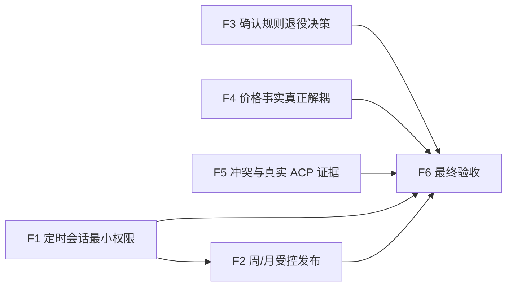

# MCP 重构验收修复任务

> 来源：[独立验收报告](./mcp-registry-and-agent-tooling-refactor-plan_acceptance_review.md)
>
> 目标分支：`refactor/mcp-registry-agent-tooling`
>
> 当前状态：Blocked for merge

## 依赖关系



F4、F5 可与 F1 并行。F2 依赖 F1 提供最终动作授权。F6 必须等待所有合并阻断项关闭。

## F1：定时 ACP 会话最小权限

**目的**：定时 ACP 可以自由使用所有批准的外部只读 MCP，但服务自有 MCP 只暴露 scope 读取和该任务唯一最终动作。

**输入**：`mcp-session-manifest.ts`、`UserContext`、service MCP tool registration、四类 scheduled task。

**输出产物**：显式 task type/final-action grant；服务工具风险分类的单一真相；按会话计算的有效 service tool allowlist；session key 使用完整有效授权指纹；运行级工具目录测试。

**边界**：不能按复盘类型限制外部研究工具；不能依赖 prompt 作为权限边界；不能把空 allowlist 当成 scheduled 默认值。

**执行步骤**：

1. 为服务 MCP 工具建立 `read` / `final-action` / `other-write` 分类，复用同一分类生成注册和授权，避免两份漂移清单。
2. 把真实 `taskType` 与 `finalAction` 从 `runAcpTask` 传到 session manifest，不再仅从 conversation ID 猜测。
3. 对 market-watch 授权 scope reads、无服务写动作；daily 授权 scope reads + `reviews.save`；weekly/monthly 使用 F2 定义的保存动作。
4. 用有效授权而不是原始可选 allowlist 生成 session key 指纹。
5. 启动实际 service MCP，断言每种 scheduled session 的 `tools/list` 不含未授权写工具。

**验收**：任一定时任务都不能发现 portfolio/watchlist/plan/onboarding/rule mutation 等无关写工具；不同 final action 不复用 session；交互会话行为不回归；scope、stage1 scheduler、MCP 和 security smoke 通过。

**失败处理**：授权无法解析时 fail closed，不启动定时 ACP；短期可回切旧 scheduled orchestrator，但不得回到全工具新路径。

**交接**：向 F2 提供 weekly/monthly 可授权的 final-action 接口；向 F6 提供每个任务实际工具目录证据。

## F2：周/月复盘受控保存与投递

**目的**：让 weekly/monthly 与 daily 一样，只有本次受控保存成功后才可投递。

**输入**：现有 `reviews.save`、`writeWorkspaceReview`、weekly/monthly Skills、F1 final-action grant。

**输出产物**：统一或扩展后的复盘保存契约，支持 kind/reportKey/full content/push brief/publication metadata；scheduled weekly/monthly 回读校验；失败不投递测试。

**边界**：服务不决定报告内容或日周月引用关系；不修改真实 Workspace Skills；不得直接把 ACP 最终文本写入并视为成功。

**执行步骤**：先审计 `reviews.save` 是否可安全扩展；采用项目现有 service API 模式支持 weekly/monthly；prompt 要求 Agent 调用唯一发布动作；服务按 user/instance/conversation/scheduled/time/kind/key 回读；只发送已保存的 push brief。

**验收**：未调用保存、保存到错误 scope、旧 artifact、内容不匹配或空 push brief 均失败且不投递；daily 不回归；scheduled publication smoke 覆盖三种 kind。

**失败处理**：保持现有 weekly/monthly 路径 feature flag 可回切；API 变更遵循 `service-api-change`，若需 schema 变更另按 `db-migration` 执行。

**交接**：向 F6 提供三类复盘成功/失败发布证据。

## F3：确认非价格规则产品决策并对齐代码

**目的**：确认删除八类非价格规则是否确为用户授权，而不是执行 Agent 推断。

**输入**：`mcp-refactor-wp6-rule-decision.md`、WP6/WP8 两个提交、用户明确答复。

**输出产物**：可审计的决策记录；若确认退役，保留当前删除方向；若未确认，恢复为软退役或按用户新决定处理。

**边界**：不查询或修改生产规则数据；不以“生产当前为 0 行”替代产品授权。

**执行步骤**：用户明确确认“八类全部退役，只保留 price_cross”；将确认结论写入决策文档；核对 API/catalog/docs 一致。

**验收**：代码行为与明确决策逐项一致，存量处理策略仍保持 no-delete-first。

**失败处理**：没有明确答复时阻断合并涉及删除的提交。

**交接**：向 F6 提供产品决策状态。

## F4：完成窄价格事实契约

**目的**：让确定性 price rule 真正脱离通用市场 capability，并补齐创建期证券代码契约。

**输入**：腾讯 quote provider、一个明确 fallback、`rule-price-facts.ts`、watch-rule create/update、现有 fixture。

**输出产物**：规则专用 provider adapter、短 TTL、逐代码 fallback、严格 `RulePriceFact`；规范代码验证/解析；存量只读审计报告。

**边界**：不通过 ACP；不恢复指标规则；不改 cooldown/dedupe/event/delivery；不自动 backfill 生产数据。

**执行步骤**：从 provider 层组合腾讯主源和一个 fallback，不导入 `marketDataReadCapability`；实现 tick 内/短 TTL 去重；创建时名称解析为唯一代码并要求确认歧义；执行时只接受规范代码；扫描隔离 fixture/只读统计生成存量报告。

**验收**：同代码缓存命中；部分失败逐项 fallback；非法/歧义代码拒绝创建；无效、过期和缺失事实不触发；stage2 smoke 和 provider failure tests 通过。

**失败处理**：保留 feature flag 回切旧 quote；发现需 backfill 时停止并另立数据库迁移任务。

**交接**：向 F6 提供依赖扫描，证明 rule path 不再导入通用 capability。

## F5：工具冲突策略与真实 ACP 端到端证据

**目的**：证明多个完整 MCP 服务器可在真实 codex-acp 会话共存，并明确处理工具名冲突。

**输入**：MCP registry、market-data-tool、本地 codex-acp、现有 raw MCP probe。

**输出产物**：运行时命名空间能力结论；冲突 fixture MCP；真实 Invest Agent -> codex-acp -> MCP -> Agent 回答 probe；脱敏结果记录。

**边界**：不记录工具原始业务数据或 secret；不建设通用代理；live 结果不作为长期 golden value。

**执行步骤**：用两个包含同名工具的 fixture MCP 启动 codex-acp；若 runtime 自动 namespace，固定其可观察契约；若不支持，注册健康探针必须拒绝冲突；再让 ACP 实际调用 `market-data-tool` 并验证列式 JSON 被正确用于回答。

**验收**：冲突不会静默覆盖服务工具；真实 ACP 会话可看到并调用外部 MCP；外部进程环境不含 Workspace/DB/sandbox/service token；命令可重复运行。

**失败处理**：无法证明 namespace 时按 fail closed 实现注册时冲突检测；不得靠文档宣称安全。

**交接**：向 F6 提供命令、时间、版本、脱敏日志和结果。

## F6：修正文档、验证命令并重新独立验收

**目的**：关闭验收偏差，形成可合并证据。

**输入**：F1-F5、原计划、本独立验收报告、分支自带 WP9 报告。

**输出产物**：修正后的 WP9 状态和 acceptance matrix；自包含 publication smoke 或明确的隔离 eval runner；干净 diff；最终 merge readiness 记录。

**边界**：不能把已知遗留继续标为 Pass；不能使用真实 Workspace/生产 DB 补 smoke；不执行生产启用或部署。

**执行步骤**：让 `smoke:scheduled-review-publication` 在隔离环境自包含运行，或新增明确的安全 wrapper 命令；删除不实的 ACP live 声明；运行全部计划命令；执行 `git diff --check` 和主线合并演练；由独立 reviewer 重新验收。

**验收**：

```bash
npm run verify
npm run smoke:mcp-service-tools
npm run smoke:stage1-scheduler
npm run smoke:stage2-watch-rules
npm run smoke:scheduled-review-publication
npm run smoke:security-boundary
npm run smoke:db-legacy-migration
git diff --check main...HEAD
```

全部 exit 0；没有 P1/P2 未解决项；分支仍与最新 main 可无冲突合并。

**失败处理**：任一 scope、未授权写入、错误发布或规则误触发失败都阻断合并；非阻断 live provider 波动单独记录。

**交接**：通过后输出明确的 merge commit/fast-forward 建议，但仍由用户授权实际合并。

---

## 第二次复验任务（基于 `9456d39`）

### R1：封闭 periodic review 文件与资源 scope

**目的**：保证 `reviews.save(kind=weekly/monthly)` 只能写本次任务授权的规范报告键，不能逃逸目录、覆盖其他 Workspace 文件或跨实例误认旧产物。

**输入**：`saveReview`、`saveSkillPeriodicReview`、`periodicReviewBackend`、scheduled `reportKey`。

**输出产物**：严格 report-key value object；路径 containment helper；scheduled expected resource binding；结构化持久化；多实例/多行 round-trip 测试。

**边界**：不得只靠 prompt 约束 key；不得吞掉 mirror 写失败后仍返回成功；不得手写 YAML parser。

**执行步骤**：

1. weekly 仅接受服务生成的周键格式，monthly 仅接受服务生成的月键格式；拒绝 `/`、`\\`、`.` 段、绝对路径和编码变体。
2. 在写入前用 `resolve` + relative containment 验证 `.md` 与 metadata 文件都位于预期 `reports/<kind>/` 下。
3. 把本次 expected kind/reportKey 纳入服务强制的 task grant/context；scheduled 保存必须完全匹配，不能先写错误 key 再由 scheduler 回读失败。
4. 使用项目 YAML 库或 JSON structured API 保存 metadata，验证多行 Markdown、冒号、井号和 Unicode 原样往返。
5. 保存任一步失败都使 `reviews.save` 失败，不发布 artifact、不投递。

**验收**：`../../AGENTS`、`../daily/x`、绝对路径、错误周期 key 均在任何写入前拒绝；真实 `AGENTS.md` 保持不变；weekly/monthly 的 content、push brief、publication metadata 原样往返；错误 instance/conversation/key 不被 scheduler 接受。

**失败处理**：继续由 `SCHEDULED_REVIEW_LEGACY_ORCH` 回切旧路径，但不得启用有路径逃逸的新保存路径。

**交接**：向 R6 提供临时 Workspace 内的攻击用例与文件树前后对比。

### R2：把 scheduled grant 改成前缀级 fail closed

**目的**：任何 scheduled 会话，包括未来新增但未登记的类型，都不得因空 allowlist获得全部工具。

**输入**：`inferSessionKind`、`resolveAllowedTools`、`resolveScheduledServiceGrant`、session key。

**输出产物**：`taskType.startsWith("scheduled-")` 的统一只读兜底；已知任务 final action 映射；实际 manifest/tool list 测试。

**边界**：interactive 空 allowlist 的现有全工具语义可以保留；evaluation 不得误入 scheduled。

**执行步骤**：生产 resolver 直接识别所有 scheduled 前缀并调用 grant resolver；未知类型只读；不存在 taskType 但 conversation 属 scheduler 时要么显式拒绝，要么可靠推导只读；session fingerprint 使用最终 grant。

**验收**：`scheduled-unknown` 的实际 service MCP `tools/list` 只有 read tools；没有任一 other-write/final-action；测试必须调用 `resolveSessionMcpServers`，不能只测 helper。

**失败处理**：无法确认类型时 fail closed 为 reads-only 或拒绝建会话，不能回落全工具。

**交接**：向 R6 提供已知四类 + 未知类型的实际目录证据。

### R3：把工具冲突检测接入会话创建

**目的**：让冲突探针成为生产安全边界，而不是未调用的辅助模块。

**输入**：manifest resolver、`getOrCreateSession/newSession`、外部 MCP 健康状态、冲突 probe。

**输出产物**：会话创建前冲突检查与缓存；失败策略；清理子进程；运行级冲突测试。

**边界**：不能每轮 prompt 重启所有 MCP 做探针；不能让 probe 继承不必要环境；不能在探针失败时悄然放行未知外部 server。

**执行步骤**：按 manifest fingerprint 缓存 tools/list/冲突结果；service MCP 或外部 MCP 版本/config 变化时失效；外部探针失败则该 server 不进入 manifest，冲突则拒绝冲突外部 server或整个会话；确保 probe 子进程超时/退出均被回收。

**验收**：fixture 外部 server 与 `reviews.save` 重名时，`newSession` 前被阻断；无冲突时正常装配；断连外部 server 不影响 service MCP，但不会被当作健康 server交给 ACP。

**失败处理**：默认保留 service MCP并剔除问题外部 server；涉及 service 工具遮蔽时 fail closed。

**交接**：向 R5/R6 提供真实调用栈与运行日志。

### R4：移除 market-watch prompt 的服务研究编排

**目的**：完成上轮遗漏的 WP4 要求，让 ACP/Skills 决定数据工具和 `NO_PUSH`。

**输入**：`buildMarketWatchTaskPrompt`、通知策略、legacy flag、相关 contract tests。

**输出产物**：新路径的最小任务 prompt；更新后的测试；legacy prompt 只保留在 legacy 路径。

**边界**：服务仍传 scope、调度窗口和通知配置；不删除 scheduler 的幂等/频控/投递；不强制任一具名市场工具。

**执行步骤**：删除“至少一个具名行情能力”和固定模式禁止 `NO_PUSH` 等服务研究决策；改为让 Workspace Skills/通知策略和 ACP输出决定；服务只解释精确输出协议。

**验收**：新 prompt 不含具体读工具、数据顺序或强制研究步骤；`NO_PUSH` 不产生 fallback；legacy flag 的旧行为仍可回切。

**失败处理**：质量不稳定通过隔离 eval 反馈给 Skill，不把具名工具强制重新写回服务新路径。

**交接**：向 R6 提供新旧 flag 两套 prompt 快照。

### R5：重做真实 ACP 外部工具调用证据

**目的**：证明 Agent 实际调用了 `market-data-tool` 并消费其返回，而不是只证明 ACP 能回复。

**输入**：R3 已接线冲突策略、market-data-tool、本地 codex-acp、tool-call event或外部 MCP可关联日志。

**输出产物**：明确要求调用一个无副作用工具的 E2E probe；调用证据；结果 schema 断言；脱敏记录。

**边界**：不固化实时价格；不记录原始业务结果或 secret；没有调用证据不能标 Pass。

**执行步骤**：使用 `list_capabilities` 或固定 fixture MCP 工具，要求 Agent必须调用；通过 ACP tool-call event、fixture server计数器或关联日志验证恰有调用；断言回答包含由返回值派生的稳定 sentinel，而不是模型常识。

**验收**：禁用/破坏外部 MCP时 probe 必须失败；正常时存在工具调用证据和 sentinel；两个 server 同时装配且无环境泄漏。

**失败处理**：runtime 不暴露 tool event 时使用 fixture MCP 的进程外计数/日志，不能以自然语言回复替代。

**交接**：向 R6 提供可复现命令、版本和脱敏证据。

### R6：真正隔离 publication smoke 并重新验收

**目的**：让合并门禁不触碰非测试状态、不把 skip 当 pass，并完成第三方复验。

**输入**：R1-R5、`.env` 加载行为、eval credential机制、原计划命令。

**输出产物**：临时 DB/Workspace/Runtime/Reviews 根的 wrapper；凭据前置检查；清理验证；更新后的独立验收记录。

**边界**：不得使用 `.env` 的生产/本地真实 DB_PATH；不得留下 eval用户、Workspace、review或 auth；SKIPPED 不能 exit 0并记为 Pass。

**执行步骤**：用 `mktemp -d` 创建明确根目录并覆盖所有状态环境变量；只读复制所需测试凭据到隔离 Workspace；运行后清理；无 backend/credential 时返回明确非零或由验收标 Unknown；然后运行全量门禁。

**验收**：publication smoke 成功时确实保存并回读；故意破坏 reviews.save 时失败；执行前后真实 DB/Workspace校验和不变；`verify`、所有 smoke、diff check、merge dry-run 全通过。

**失败处理**：任何真实状态变化、skip-as-pass、scope/path traversal 或冲突放行都阻断合并。

**交接**：只有独立 reviewer 判定无 P0-P2 后，才执行用户已授权的 main 合并。

---

## Closure

2026-07-30 最终复验已关闭 R1-R6，未发现剩余 P0-P2。实现提交 `cfb55eb` 已 fast-forward 合并到 `main`；完整证据见同目录的 `mcp-registry-and-agent-tooling-refactor-plan_acceptance_review.md` 最终复验章节。
