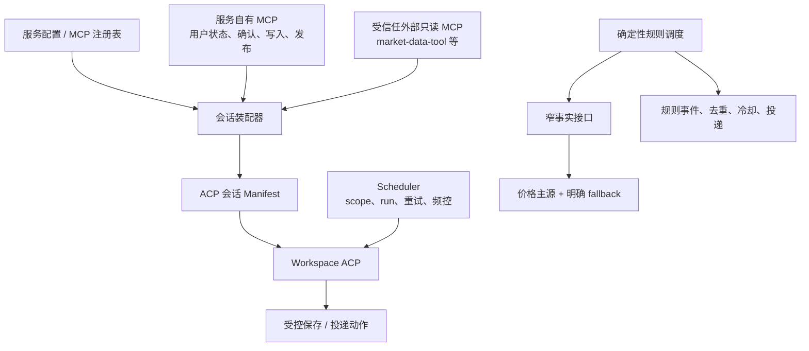
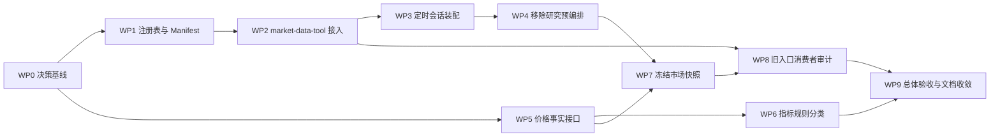

# MCP 注册与 Agent 工具架构重构计划

> 状态：待执行
>
> 决策来源：[数据源架构讨论笔记](./data-source-architecture-discussion-notes.md)
>
> 适用基线：`main`。实施必须保留现有工作树改动，不得触碰真实 Workspace、生产 SQLite、`reviews/`、`.state/`、微信状态或生产凭据。

## 一、结果定义

这次改造不是“替换一个行情 provider”，而是把当前混在一起的三条路径拆开：

1. **ACP 开放式研究路径**：服务注册并装配受信任的外部只读 MCP，ACP 直接发现和调用其工具，不再要求 Invest Agent 为每个工具维护字段适配器。
2. **定时 ACP 路径**：scheduler 只负责 scope、运行幂等、重试、频控和投递；研究方法、数据工具选择、复盘结构由 Workspace Skills 和 ACP 决定。
3. **确定性规则路径**：服务使用窄、稳定的事实接口执行规则，不经 ACP；价格类规则先收敛到批量价格读取，指标类规则单独决策。

完成后，`market-data-tool` 可以作为一个完整 MCP 服务器接入 ACP，并随自身 `tools/list` 演进；服务仍然掌握准入、启停、凭据、scope、副作用权限和最小运行观测。

## 二、目标架构



### 2.1 服务层拥有的控制面

- MCP 服务器目录：稳定 ID、所有者、传输、版本约束、凭据引用、信任类别、启停状态。
- 会话装配：根据 backend、用户/实例 scope、任务类型和最终动作权限生成本次 manifest。
- 安全边界：外部 MCP 不获得 Workspace、SQLite、sandbox token 或服务写入凭据。
- 副作用边界：确认、写入、报告发布、规则修改和投递继续只由服务自有 MCP/服务 API 强制。
- 最小观测：记录会话装配了哪些服务器及版本、运行是否成功；第一阶段不记录原始工具输入输出。

### 2.2 ACP 与 Workspace Skills 拥有的研究面

- 从本次会话实际暴露的 MCP 工具中自主选择数据和调用顺序。
- 根据用户问题和 Workspace Skills 完成开放式回答、盘中简报和日/周/月复盘。
- 决定报告内容、历史报告引用关系、信息不足表达以及是否输出 `NO_PUSH`。
- 不把提示词、Skill 或 Workspace 文件当作 scope、写入授权或投递安全边界。

### 2.3 Scheduler 拥有的运行面

- 规范化 `userId`、`instanceId`、Workspace、任务类型、调度窗口和 run ID。
- 对 `(taskType, userId, instanceId, scheduledWindow)` 保证单一有效运行。
- 管理租约、重试、并发、最小间隔、过期和最终投递。
- 不预抓行情、不规定具名研究工具、不校正 ACP 选择的数据源、不强制生成兜底简报。

### 2.4 确定性规则拥有的事实面

价格类规则的目标接口为：

```ts
type RulePriceFact = {
  code: string;
  price: number | null;
  asOf: string | null;
  usable: boolean;
  provider: string | null;
  failureCode?: string;
};

getRulePrices(codes: string[]): Promise<Map<string, RulePriceFact>>
```

约束：输入必须是已确认的规范证券代码；同一 tick 批量去重；腾讯行情为主源，一个明确 provider 为 fallback；只有有限、非空且满足时效策略的价格可以触发规则。名称到代码的解析发生在规则创建或修改时，而不是每次调度时。

## 三、范围与非目标

### 本计划包含

- 服务侧 MCP 注册表、会话 manifest 和启停机制。
- `market-data-tool` 的本地端到端接入及动态 `tools/list` 验证。
- 定时 ACP 会话装配，以及 market-watch 和复盘服务预编排的移除。
- 价格类确定性规则的窄事实接口和迁移。
- 指标类规则的消费者/产品价值分类与后续实现决策。
- `market_watch_snapshots` 依赖冻结、旧市场工具/API 的消费者审计和分阶段退役。
- 当前架构文档、测试、运行验收和独立验收记录。

### 本计划不包含

- 通用 MCP 网关、逐字段转换代理或原始工具结果仓库。
- 让外部 MCP 获得用户 Workspace、数据库或任何写入权限。
- 服务层定义复盘报告结构、日周月引用方式或研究流程。
- 用模型执行确定性规则，或承诺捕捉两个 scheduler tick 之间发生的瞬时穿越。
- 首轮就删除 SQLite 表、历史快照、旧接口或 provider 实现。
- 自动修改任何真实 Workspace Skill 或采用模板差异。
- 为未来可能需要的“相对上一调度窗口变化”预先保留全量市场快照。

## 四、与旧能力平面计划的关系

[能力平面渐进式抽离计划](./capability-plane-extraction-plan.md) 已经完成的抽离和测试资产不是无效工作，但其后续集成方向有一部分被本计划替代。

| 旧计划判断/成果 | 本计划处理 | 原因 |
| --- | --- | --- |
| provider、research、indicator 的纯能力边界、fixture runner、离线测试 | **保留** | 仍可用于独立开发、确定性测试和规则侧实现 |
| `marketDataReadCapability` 作为现有调用方的过渡兼容层 | **暂时保留** | 迁移期间维持旧 MCP/HTTP/规则行为，不能先删 |
| 外部数据必须经服务 adapter 归一化后才能供 ACP 使用 | **替代** | 开放式 ACP 可以直接消费受信任外部只读 MCP 的原生结果 |
| 现有市场 MCP 工具长期作为 ACP 稳定兼容面 | **转为待退役兼容面** | 新会话以服务器注册和动态发现为主，是否删除要先审计消费者 |
| scheduler、review、规则共享同一市场 capability | **替代** | 三类消费者的正确契约不同 |
| `market.snapshot` 留在服务中聚合用户状态和行情 | **冻结并拆分** | 用户状态继续由服务读；开放行情由 ACP 工具读；规则走窄事实接口 |
| provider telemetry/source quality 是 ACP 研究链的必要统一资产 | **降级为旧路径运维资产** | 外部 MCP 自己负责数据质量；服务只保留自身运行需要的健康信息 |

本计划生效后，执行者不得再依据旧计划把新外部 MCP 逐工具包装进 `invest-agent-service-tools`，也不得为了复用旧 capability 而恢复 scheduler 的行情预抓取。

## 五、关键契约

### 5.1 MCP 注册项

首版注册表使用服务拥有的静态配置，不引入数据库管理后台。最小模型：

```ts
type McpServerRegistration = {
  id: string;
  owner: "invest-agent" | "external";
  enabled: boolean;
  trustClass: "service-scoped" | "external-readonly";
  transport:
    | { kind: "stdio"; command: string; args: string[]; envRefs?: string[] }
    | { kind: "streamable-http"; url: string; headerRefs?: string[] };
  versionPolicy?: { expected?: string; allowedRange?: string };
  sessionKinds: Array<"interactive" | "scheduled-read" | "evaluation">;
};
```

注册表只存 secret 引用，解析后的凭据只进入对应子进程或传输请求，不能进入 trace、manifest 摘要或用户可见输出。

### 5.2 会话 Manifest

manifest 是一次会话的解析结果，不是第二份工具目录：

```ts
type AcpMcpSessionManifest = {
  sessionId: string;
  runId?: string;
  userId: string;
  instanceId: string;
  taskType: string;
  servers: Array<{
    id: string;
    transportKind: "stdio" | "streamable-http";
    version?: string;
    configFingerprint: string;
  }>;
};
```

只持久化或记录上面的脱敏摘要。工具清单以服务器在本次 MCP 握手返回的 `tools/list` 为准；运维缓存不得成为 ACP 调用真相。

### 5.3 定时 ACP 输出

- `market-watch`：精确 `NO_PUSH` 表示不投递；其他非空正文进入现有投递链。
- 日复盘：只有本次 scope 和 conversation 下成功的 `reviews.save` 才算完成；完整报告必须保存，微信只发送已保存的 `pushBrief`。
- 周/月复盘：最终也应通过明确的保存/发布契约完成，不能以服务拼装的 `reviewContext` 作为正确性依据。
- 通知策略决定何时触发和是否允许推送；服务不添加“无异常也必须发”的隐含政策。

### 5.4 工具名冲突

优先使用 ACP 客户端提供的服务器命名空间。如果实际客户端把所有工具放在一个平面命名空间，则注册/启动探针必须拒绝重名，并报告冲突服务器和工具名；不得按注册顺序静默覆盖。服务自有写工具永远不能被外部工具遮蔽。

## 六、迁移与发布策略

采用 branch-by-abstraction，每个阶段都保留可回滚的旧路径：

```text
建立注册表和 manifest（默认只装配现有服务 MCP）
  -> 接入 market-data-tool（先仅测试/显式开关）
  -> 定时会话改用注册表装配
  -> 移除 market-watch / review 的研究预编排
  -> 价格规则切换到窄事实接口
  -> 冻结 snapshot 写入与旧兼容入口新增依赖
  -> 审计后逐项退役旧入口
```

统一发布门禁：

1. 新能力默认关闭或仅对测试 scope 开启。
2. 每个工作包独立通过离线测试和对应 smoke，才可进入下一包。
3. 生产开关、真实 Workspace、真实数据库迁移和部署均需另行明确授权。
4. 遇到外部 MCP 不健康时，ACP 会话应明确缺少该服务器，而不是自动获得服务写凭据或退回任意 HTTP。
5. 回滚优先关闭外部 MCP/恢复旧调用路径，不回滚或覆盖用户数据。

### 数据库策略

- MCP 注册表首版不建表，使用受版本控制的服务配置加环境 secret 引用。
- 若现有 ACP trace 无法保存 manifest 摘要，可增加一个 nullable JSON/text 字段；必须使用 Drizzle schema + migration，先在隔离数据库验证旧库升级和新库 bootstrap。
- `market_watch_snapshots` 第一阶段只停止新写入和读取，表及历史数据保留。
- 物理删除表必须是独立任务：先做生产备份、引用扫描、保留窗口确认和显式授权；不属于本计划默认执行范围。

## 七、任务依赖图



WP1-W4 是 ACP 工具链；WP5-W6 是确定性规则链，两条链在 WP0 后可并行实施。WP7 必须等待 ACP 不再读 snapshot 且价格规则不再依赖通用 capability。WP8 只做有证据的退役。WP9 负责独立验收，不替代各包自己的测试。

## 八、工作包

### WP0：冻结决策与增量消费者基线

**目的**：把本计划变成当前实现输入，并防止后续执行继续沿用旧计划的冲突假设。

**输入**：本计划、讨论笔记、`capability-plane-wp0-baseline.md`、现有生产入口和测试。

**明确产物**：

- 一份增量调用方矩阵，覆盖 MCP 组装、scheduled tasks、review context、snapshot、规则、HTTP/Platform 和测试。
- 一份旧计划冲突项状态表，标记“保留、过渡、替代、待审计”。
- 每个待移除入口的现有消费者和测试基线。

**边界**：不改运行行为；不重新制作旧 WP0 已有 fixture；不读取真实用户数据证明消费者存在。

**执行步骤**：用 `rg` 和静态 import 扫描建立矩阵；运行基线测试；记录失败是否为既有问题；把当前权威文档中的冲突条目列为后续 WP9 更新清单。

**验收**：矩阵能回答每个旧市场入口“谁在调用、是否有副作用、由哪个工作包迁移”；`npm run typecheck`、`npm run build` 和目标 smoke 基线有记录。

**失败处理**：发现未知外部客户端或运行时动态调用时，相关入口标记为“阻塞退役”，不猜测删除。

**交接**：向 WP1 提供 MCP 入口清单；向 WP5/WP6 提供规则类型与调用链；向 WP8 提供兼容入口清单。

### WP1：实现配置型 MCP 注册表与会话 Manifest

**目的**：把 `buildInvestAgentMcpServers()` 的硬编码单服务器配置改为受控注册和会话解析，同时保持默认行为不变。

**输入**：WP0 MCP 清单、`src/acp/stdio-agent.ts`、ACP SDK 实际支持的 transport 类型、现有 eval 开关。

**明确产物**：

- `src/acp/mcp-registry.ts`：注册模型、校验、启停和 secret 引用解析。
- `src/acp/mcp-session-manifest.ts`：按 backend/scope/task 组装脱敏 manifest。
- `stdio-agent.ts` 通过 manifest 构建 ACP `mcpServers`，默认仍只启用 `invest-agent-service-tools`。
- transport 能力探针与单测：明确当前 ACP 是否支持 Streamable HTTP；不支持时首版只启用 stdio。
- manifest 摘要记录方案；若需要 schema 变更，包含 Drizzle migration、legacy migration smoke 和回滚说明。

**边界**：不做图形管理后台；不允许从 Workspace 注册 MCP；不记录 secret 或工具结果；不改变现有服务 MCP scope 环境变量。

**执行步骤**：先定义纯配置模型和验证器；迁移现有服务 MCP 为内建注册项；实现任务会话解析；验证命名空间/重名策略；最后接入脱敏 trace。

**验收**：禁用所有 MCP、非 Codex backend、eval allowlist、用户/实例 scope 等旧行为不回归；未知 transport、缺少 secret、重复 server ID 或工具冲突均 fail closed；通过 `npm run smoke:mcp-service-tools`、相关 ACP env 单测和 `npm run verify`。

**失败处理**：若 HTTP transport 未被当前 ACP 支持，只记录能力缺口并保持类型不可启用，不写临时协议代理；若 trace schema 迁移失败，manifest 先写结构化运行日志，数据库变更退回独立补充任务。

**交接**：向 WP2 提供注册 API、支持的 transport 和冲突检测接口；向 WP3 提供会话解析函数。

### WP2：接入本地 `market-data-tool` 并验证动态发现

**目的**：证明外部 MCP 可以整服务器接入 ACP，且新增工具不需要 Invest Agent 逐工具改代码。

**输入**：WP1 注册接口、`../market-data-tool/README.md` 与 `docs/api.md`、本地 stdio/HTTP 启动方式。

**明确产物**：

- 一个默认关闭的 `market-data-tool` 外部只读注册项。
- 本地配置示例仅包含路径/URL和 secret 引用，不写开发机绝对路径到生产默认值。
- MCP 合约探针：`initialize -> tools/list -> tools/call(get_realtime_quote)`。
- ACP 端到端测试：会话能看到该服务器当前 15 个工具，并能消费列式 JSON；测试通过增加/替换 fixture 工具证明 Invest Agent 无逐工具映射。
- 工具名冲突、服务不可达、调用超时和结构化错误的测试。

**边界**：不把外部工具复制进 `invest-agent-service-tools`；不把列式 JSON 转成旧 market contract；不把外部 MCP 当规则引擎事实源；真实网络 probe 必须显式运行。

**执行步骤**：优先采用 WP1 已验证的原生 transport；若两种 transport 都可用，本地开发优先连接已启动的 Streamable HTTP，生产方案另行评估；执行握手、目录和最小行情调用；再从 ACP 会话完成一次开放式查询。

**验收**：关闭注册项时行为与 WP1 基线一致；开启后新会话可发现工具；外部新增工具不需 Invest Agent 代码分支；外部 MCP 不收到 `DB_PATH`、Workspace、sandbox secret 或服务 token；离线合约测试和显式本地 live probe 均有记录。

**失败处理**：连接失败只使该服务器健康检查失败并阻止其进入目标会话，不能阻止服务自有 MCP 启动；保留一键关闭注册项的回滚路径。

**交接**：向 WP3 提供已验证注册 ID、健康语义、启动成本和 transport 限制；向 WP8 提供与旧市场工具的能力重叠表。

### WP3：统一交互与定时 ACP 的 MCP 会话装配

**目的**：让开放对话和定时只读任务都从同一注册表获得工具，同时保留 scope 和副作用权限。

**输入**：WP1 manifest、WP2 外部 MCP、现有 `UserContext.mcpAllowedTools` 和 scheduled run 模型。

**明确产物**：

- 交互会话：全部已启用外部只读 MCP + 当前 scope 的服务 MCP。
- 定时会话：同样的只读 MCP + scope 状态读取 + 该任务唯一最终动作。
- 替代普通任务级读工具 allowlist 的风险例外机制，只用于写入、高费用、敏感或隔离任务。
- run/session/manifest 关联测试及重复运行、跨用户 scope 测试。

**边界**：不在装配器中定义“复盘要调用哪些工具”；不扩大服务写工具权限；不把用户状态传给外部 MCP。

**执行步骤**：把 task type 和 final-action grant 纳入 manifest 输入；迁移 interactive、market-watch、daily/weekly/monthly review 调用点；保留 evaluation 的显式隔离能力；验证开关只对新会话生效。

**验收**：两个用户并发会话的服务 MCP scope 隔离；外部 MCP 环境相同且无用户私有状态；定时任务不能调用未授权写动作；`scheduled_task_runs` 的幂等、租约、重试和频控测试不回归；通过 `npm run smoke:stage1-scheduler` 和 `npm run verify`。

**失败处理**：manifest 解析失败时不启动缺少安全边界的 ACP 会话；可通过关闭外部注册项回到只含服务 MCP 的旧行为。

**交接**：向 WP4 提供已经无需具名读工具 allowlist 的会话保证；向 WP9 提供 scope/权限验收用例。

### WP4：移除 market-watch 与复盘的服务研究预编排

**目的**：让 scheduler 回到“触发和交付”，把开放研究完全交还 ACP 与 Workspace Skills。

**输入**：WP3 会话装配、`src/acp/scheduled-tasks.ts`、`src/handlers/review.ts`、`mobile-prompt.ts`、现有复盘发布契约。

**明确产物**：

- 删除 `MARKET_WATCH_ALLOWED_TOOLS`、snapshot 预抓取、具名行情审计、纠正重跑、文本/快照矛盾检测和强制兜底简报。
- 删除日/周/月复盘的固定行情、K 线、指标、新闻、提醒/行为预聚合，以及“数据已经提供、不得调用工具”的 prompt。
- market-watch 只处理精确 `NO_PUSH` 或可投递正文。
- 日/周/月复盘均以明确保存/发布成功作为完成条件，完整报告继续保存。
- sandbox/兼容 review context 路由的消费者结论：迁移、弃用或暂留，不静默改变外部调用方。

**边界**：不编辑真实 Workspace Skills；不在服务里重新实现日周月报告关系；不降低 `reviews.save` 的 scope、确认或发布校验。

**执行步骤**：先补充行为测试；再移除 market-watch 校正链；然后分别迁移 daily、weekly、monthly；最后清理只为 `reviewContext` 服务的 prompt/trace 字段引用，数据库字段仍先保留。

**验收**：ACP 可以自由选择任意已启用只读 MCP；未调用旧具名工具不再判失败；`NO_PUSH` 不产生 fallback；日复盘未成功保存时不投递；周/月完整报告可保存并投递简报；通过 `npm run smoke:scheduled-review-publication`、`npm run smoke:stage1-scheduler`、相关 mobile prompt 测试和 `npm run verify`。

**失败处理**：按任务类型保留短期 feature flag 回切旧编排；若某 Workspace Skill 缺少完成任务所需说明，只报告兼容差异，未经逐用户确认不得覆盖真实 Skill。

**交接**：向 WP7 提供 snapshot 已无 ACP 消费者的证据；向 WP9 提供复盘/NO_PUSH 回归记录。

### WP5：实现窄价格事实接口并迁移价格类规则

**目的**：让价格阈值规则脱离完整 `marketDataReadCapability` 和 ACP。

**输入**：WP0 规则清单、现有腾讯/备选 provider、`watch-rules.ts` 的 `price_cross` 路径和规则创建/修改 API。

**明确产物**：

- 独立的 `RulePriceFact` contract 和 `getRulePrices(codes)` 批量实现。
- 腾讯主源 + 一个显式 fallback、短 TTL、批量去重、超时和失败码。
- `price_cross` 调度和 dry-run 迁移；同一 tick 对所有价格规则只批量获取一次。
- 规则创建/修改时的代码规范化与名称解析策略，已存规则的只读审计报告。
- 仅在确有无代码旧记录时才提出数据 backfill；不得自动模糊匹配并写生产数据。

**边界**：只迁移 `price_cross`；不把 MA/MACD/KDJ/RSI/BOLL/WR/成交量等规则塞进价格接口；不改变 cooldown、dedupe、事件和投递语义。

**执行步骤**：先建立 fixture contract；实现批量主源/fallback；将规则 runner 改为 tick 级预取并注入 facts；迁移 dry-run；最后核对规则创建和编辑入口。

**验收**：重复代码只请求一次；单代码主源失败可逐项 fallback；`NaN`、无穷、空值、过期或错误代码均不触发；provider 全失败时规则保持未触发且留下最小诊断；通过目标单测、`npm run smoke:stage2-watch-rules` 和 `npm run verify`。

**失败处理**：feature flag 回切旧 quote 路径；接口异常不能跳过 cooldown/幂等或生成假触发；发现需 backfill 时停止写入并按 `db-migration` 流程另立迁移任务。

**交接**：向 WP6 提供剩余规则列表；向 WP7 提供价格规则已无 snapshot/通用 quote 依赖的证据。

### WP6：分类并决定非价格确定性规则

**目的**：明确现有八类非价格规则的产品价值和事实契约，避免在架构收敛中误删或假装它们只需要当前价。

**输入**：`ma_cross`、`macd_cross`、`kdj_cross`、`rsi_threshold`、`boll_break`、`wr_threshold`、`volume_ratio`、`near_plan_level` 的实现、实际启用记录的脱敏统计和调用方。

**明确产物**：

- 每类规则的消费者、启用量、用户可见入口、事实需求、采样语义和维护成本矩阵。
- 技术建议分组：`near_plan_level` 可评估复用价格事实 + 服务计划状态；其余 K 线/指标规则需要独立 deterministic series contract。
- 需要用户决策的产品清单：保留、降级为 beta/禁止新建、或正式退役。
- 对已决定保留的规则分别形成后续任务契约；未获决定前保持旧行为。

**边界**：本工作包默认不删除规则、不迁移历史记录、不改变已有规则结果；不能把“代码已存在”当作产品价值证据。

**执行步骤**：统计静态入口与隔离环境数据形状；核对产品文档和现有 UI/MCP 暴露；评估规则是否真需要盘中确定性承诺；把技术可行性与产品价值分开呈现给用户决策。

**验收**：八种非价格规则都有明确归类，且每个建议能说明用户价值、数据需求、失败语义和迁移成本；任何待退役规则都有存量用户处理方案。

**失败处理**：拿不到可靠使用证据时标记未知并维持兼容，不根据测试存在与否推断生产使用。

**交接**：向 WP9 提供已决项；保留类规则各自创建新任务，不阻塞 MCP 注册主链。

### WP7：冻结 `market_watch_snapshots` 与通用 snapshot 依赖

**目的**：在不删除历史数据的前提下，停止为已放弃的“上一窗口精确差分”持续维护全量快照链。

**输入**：WP4 ACP 消费者清零证据、WP5 规则迁移证据、`market-watch-snapshot.ts`、`market.snapshot` MCP/HTTP 消费者矩阵。

**明确产物**：

- 移除 scheduler 对 `captureMarketWatchSnapshot` 的调用。
- `market_watch_snapshots` 写入冻结，读取入口标记 deprecated 或在无消费者时关闭。
- 证明服务用户状态读取仍可独立工作，不需要聚合行情 snapshot。
- 表保留说明、观察窗口、恢复写入 feature flag 和未来物理清理前置条件。

**边界**：不 drop 表、不删除历史 rows、不清理生产 DB；不顺带删除 `market.snapshot` HTTP/MCP，除非 WP8 已证明无消费者。

**执行步骤**：静态/运行测试确认读写调用；停止新写；保留只读兼容；运行至少一个发布观察窗口后再确认无隐式依赖。

**验收**：market-watch、复盘和价格规则测试均不访问 snapshot 表；旧库升级和新库 bootstrap 仍成功；`npm run smoke:db-legacy-migration`、scheduler/rule smoke 和 `npm run verify` 通过。

**失败处理**：通过 feature flag 恢复写入；不得为修复某个旧消费者而重新耦合 ACP 主路径，先把该消费者列入 WP8。

**交接**：向 WP8 提供可退役入口和未知消费者；物理删表作为单独授权任务移交运维/数据库负责人。

### WP8：审计并逐项退役旧市场 MCP、HTTP 与 provider 运维面

**目的**：在新路径稳定后减少真实维护面，而不是长期双轨。

**输入**：WP0 消费者清单、WP2 能力重叠表、WP7 snapshot 状态、Platform/Portal/脚本/外部客户端证据。

**明确产物**：

- 每个旧 `market.*`、`research.*` MCP 工具、sandbox HTTP 路由、Platform source-quality 页面和 provider telemetry 的去留表。
- 对无消费者入口执行“禁止新增依赖 -> deprecation -> 删除”的分阶段任务。
- 对仍有非 ACP 消费者的接口保留稳定兼容层，并写清 owner 和退出条件。
- 文档和测试不再暗示 `invest-agent-service-tools` 是 ACP 唯一数据来源。

**边界**：没有调用证据不得删除；不因 MCP 替代 ACP 研究就删除 Portal/Platform/运维仍在使用的服务 API；不删除 provider fixture 和独立 runner 等有开发价值的资产。

**执行步骤**：静态扫描、日志/配置审计、测试归属核对；先加 deprecation 和禁止新依赖测试；分批移除确认无消费者的入口；每批独立回归。

**验收**：每个删除项有零消费者证据和回滚说明；保留项有明确 owner；MCP、HTTP、Platform、scheduler 和 rules 的 smoke 覆盖与实际职责一致。

**失败处理**：发现未知客户端即恢复兼容入口或暂停删除；不得用适配器把它偷偷重定向到语义不同的外部 MCP。

**交接**：向 WP9 提供最终能力表；若要物理删除 snapshot 表，另建需显式生产授权的 DB 清理任务。

### WP9：权威文档收敛、全链验证与独立验收

**目的**：确保代码、运行契约、文档和 Workspace 兼容边界一致，并由非执行者独立判定是否完成。

**输入**：WP0-WP8 交付与测试记录、当前 `docs/README.md` 索引、system overview、data-source policy、market-data/service MCP/watch runtime 文档。

**明确产物**：

- 更新当前权威文档，明确 MCP 控制面、ACP 研究面、scheduler 运行面和规则事实面。
- 将被替代的旧计划/决策移入 archive 或清晰标注 superseded；保留历史执行记录用于审计。
- Workspace Skill 兼容指南：只报告差异，任何真实 Workspace 修改需逐用户逐文件确认和备份。
- 一份全链验证记录和一份由独立 reviewer 生成的 acceptance review。

**边界**：验收不替执行者修代码；不自动迁移真实 Workspace；不把 live provider 偶发失败等同于离线契约失败。

**执行步骤**：先完成文档交叉引用扫描；运行全量和专项验证；在隔离用户/Workspace 做交互、market-watch、日周月复盘、价格规则和 MCP 故障演练；最后由独立 reviewer 对照本计划逐条验收。

**验收**：至少通过：

```bash
npm run verify
npm run smoke:mcp-service-tools
npm run smoke:stage1-scheduler
npm run smoke:stage2-watch-rules
npm run smoke:scheduled-review-publication
npm run smoke:security-boundary
npm run smoke:db-legacy-migration
```

并额外通过 MCP 注册/manifest、动态 `tools/list`、命名冲突、外部 MCP 无凭据、`NO_PUSH`、跨 scope 和 provider 失败的目标测试。live probe 单独记录环境、时间和外部失败，不取代离线测试。

**失败处理**：任何 scope、写权限、任务幂等或规则误触发问题均为阻断发布；文档不一致或旧入口消费者未知时不得宣告退役完成。

**交接**：形成最终能力目录、遗留事项和后续任务；只有所有阻断项关闭后，本计划才可标记完成。

## 九、任务路由与建议批次

| 批次 | 工作包 | 是否可并行 | 发布结果 |
| --- | --- | --- | --- |
| A | WP0 | 否 | 决策和依赖基线 |
| B | WP1、WP5 | 是 | MCP 控制面骨架；价格规则新接口 |
| C | WP2、WP6 | 是 | 外部 MCP 接通；非价格规则决策材料 |
| D | WP3 | 否 | 所有 ACP 会话统一装配 |
| E | WP4 | 否 | scheduler/review 研究预编排移除 |
| F | WP7 | 否 | snapshot 停止写入但数据保留 |
| G | WP8 | 部分可并行 | 有证据地缩减旧兼容面 |
| H | WP9 | 否 | 文档收敛和独立验收 |

每个工作包应单独提交、单独记录验证结果，并可通过开关或兼容层回退。不要把 WP1-WP9 合成一次大改；那会让 MCP 接入、定时任务行为和规则误触发风险无法分别定位。

### 执行状态机

每个工作包独立按以下状态流转：

```text
Blocked（前置产物未齐）
  -> Ready（输入、边界、基线已确认）
  -> In Progress（只修改本工作包范围）
  -> Verification（实现冻结，只修验收失败）
  -> Accepted（验收记录和交接完成）
  -> Released（仅在另获发布授权后）
```

- **进入 Ready**：依赖工作包已 Accepted，现有工作树已核对，目标 smoke 基线已记录。
- **进入 Verification**：明确产物全部存在，执行者已完成自检，没有未说明的范围扩张。
- **进入 Accepted**：验收项逐条有证据，失败项均已分类，回滚入口可用，移交笔记完成。
- **禁止操作**：Blocked 状态提前改生产代码；Verification 状态顺手重构；未获授权进入 Released；用真实 Workspace 或生产数据库补测试证据。

### 统一移交笔记

每个工作包结束时必须附一份短移交，不能只给 commit 或测试输出：

```md
## WPx Handoff
- 目标：
- 状态：Accepted / Blocked
- 已完成产物：
- 关键事实与决策：
- 修改范围：
- 验证结果：
- 已知风险/未解决项：
- 回滚入口：
- 下一工作包可依赖的稳定契约：
- 禁止下游重新假设的事项：
```

工作包质量检查统一为：产物齐全、边界未越过、没有隐含生产操作、测试覆盖成功与失败路径、外部失败与代码回归已区分、文档和实际契约一致、下游无需重做本包的事实发现。

## 十、需要用户决策的事项

架构主线已经确定，不再把以下内容当作开放问题：外部只读 MCP 以服务器注册、定时 ACP 默认获得全部启用只读工具、规则与 ACP 分离、snapshot 暂不承担窗口差分。

实施中只保留两个明确的人类决策门：

1. **WP6 非价格规则的产品去留**：技术审计完成后，由用户根据真实价值选择保留、限制新建或退役。执行者不能代替产品判断。
2. **生产数据物理清理**：包括删除 `market_watch_snapshots` 表或历史 rows，必须在备份、观察窗口和消费者清零后另行明确授权。

其余 transport 选择、测试组织、内部文件布局和 feature flag 设计由执行者按实际 ACP SDK 与项目模式作保守实现，不需要反复上升为产品决策。
