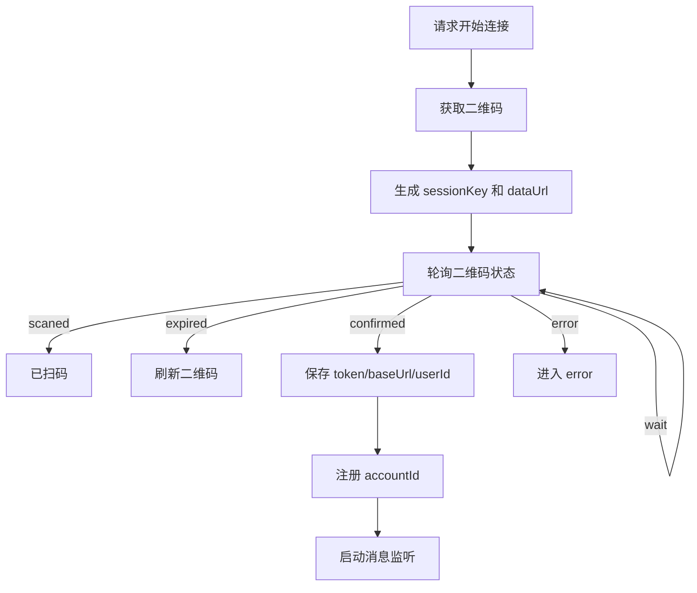

# WeChat Bridge Appendix

这份附录记录微信桥接层的可靠语义，以及这次拆分后各文件的职责边界。

它不是产品 PRD，不负责定义投资方法，只负责回答：
- 微信如何扫码连接
- 微信身份如何绑定到 user / instance / workspace
- 消息如何进出系统
- 推送如何回到微信
- 哪些状态必须保留
- 哪些故障必须显式处理
- 桥接层现在拆成了哪些文件

## 1. 当前拆分

当前微信桥接层已经拆成四块：

- `src/channels/weixin-account-store.ts`：账号状态文件、账号索引、token/baseUrl/lastConversation 持久化
- `src/channels/weixin-message-bridge.ts`：把消息交给 Agent，再把回复分片回发微信
- `src/channels/weixin-login-flow.ts`：扫码、轮询、确认登录、二维码刷新
- `src/channels/weixin-mobile.ts`：总控编排、监听启动、状态汇总、主动推送路由

这次拆分的目标不是改语义，而是把原来一个 900+ 行文件里混在一起的职责拆开。

## 2. 可信边界

高可信部分：
- 微信扫码登录
- 账号 token/baseUrl 持久化
- 微信外部身份与内部用户的映射
- 收消息后交给 workspace-scoped agent
- 回复文本分片发送
- 主动推送时按 user / instance 反查最近会话

中可信部分：
- 监听自动恢复
- 多账号并存
- 项目实例级别的微信绑定

低可信部分：
- 旧历史兼容字段
- 早期遗留状态名
- 任何没有在现有代码和文档中同时出现的桥接行为

## 3. 状态模型

```yaml
weixin_connect_state:
  stage: idle | waiting_scan | scanned | connected | error
  enabled: boolean
  backend: hermes
  accountId: string
  message: string
  qrcodeUrl: string
  qrcodeDataUrl: string
  sessionKey: string
  listenerRunning: boolean
  lastError: string
  lastConversationId: string
  lastConversationAt: string
  pushReady: boolean
```

## 4. 登录与连接流程



关键点：
- 二维码有刷新上限
- 登录 session 有时间窗
- 确认成功后才写入账号文件
- 成功后自动启动监听

## 5. 身份与绑定

微信外部身份要映射到内部：
- `userId`
- `instanceId`
- `projectId`
- `workspacePath`

绑定规则：
- 同一个 `externalUserId` 会复用或更新已有 `channel_identity`
- `channel_identity` 通过 `channel_identity_instances` 绑定到默认实例
- `projectBinding.sharedUsers = true` 时，用户身份更偏共享用户模型
- 否则优先使用 owner 绑定

持久化对象位于 `./.state/openclaw-weixin/`：
- `accounts.json`
- `accounts/<accountId>.json`

保存内容主要是：
- `token`
- `baseUrl`
- `userId`
- `lastConversationId`
- `lastConversationAt`
- `lastContextToken`

## 6. 消息进入流程

```mermaid
flowchart TD
  A[微信消息到达] --> B[resolveOrCreateChannelUser]
  B --> C[得到 userId / projectId / instanceId / workspacePath]
  C --> D[createAgent().handleMessage]
  D --> E[workspace-scoped Hermes]
  E --> F[返回文本回复]
  F --> G[rememberWeixinTurn]
  G --> H[分片后回发微信]
```

输入到 agent 的最小上下文：
- `channel`
- `conversationId`
- `userId`
- `projectId`
- `instanceId`
- `workspacePath`
- `skillBundleId`
- `strategySkillId`
- `instanceExpansionPath`

桥接层不应在这里做业务 triage。

## 7. 消息输出流程

### 6.1 文本回复

- agent 返回文本后，桥接层先记忆对话
- 再按长度分片
- 第 1 片立即回给微信
- 后续分片延迟补发

### 6.2 纯文本限制

当前桥接层对非文本消息是保守处理：
- 图片、语音、文件不作为主支持面
- 实验版只保证文本路径

## 8. 主动推送流程

主动推送时先找目标会话：

1. 优先按 `instanceId` 找绑定会话
2. 找不到再按 `userId` 找最近会话
3. 仍找不到时使用最近一次会话或直接跳过

推送前的硬条件：
- 账号已连接
- 有 token
- 有可用 `conversationId`

如果绑定账号和当前账号不一致，要跳过并记录警告。

## 9. 监听与恢复

- 连接成功后自动启动监听
- 启动监听时会读取当前已注册账号
- 每个账号独立维护一个 listener
- listener 异常退出要写入错误状态
- 关闭连接会停止当前 listener

## 10. 可靠性边界

必须保留：
- 扫码成功后保存账号 token
- conversationId / contextToken 的持续写回
- 监听状态与 lastConversation 状态
- 分片发送
- 主动推送失败时的可见错误

不必保留：
- 旧的运行时后端名
- 旧平台化抽象
- 与桥接无关的业务捷径

## 11. 代码证据

主要证据来自：
- [src/channels/weixin-account-store.ts](/Users/combo/MyFile/projects/invest-agent-ideal/src/channels/weixin-account-store.ts)
- [src/channels/weixin-message-bridge.ts](/Users/combo/MyFile/projects/invest-agent-ideal/src/channels/weixin-message-bridge.ts)
- [src/channels/weixin-login-flow.ts](/Users/combo/MyFile/projects/invest-agent-ideal/src/channels/weixin-login-flow.ts)
- [src/channels/weixin-mobile.ts](/Users/combo/MyFile/projects/invest-agent-ideal/src/channels/weixin-mobile.ts)
- [src/lib/user-identity.ts](/Users/combo/MyFile/projects/invest-agent-ideal/src/lib/user-identity.ts)
- [src/server.ts](/Users/combo/MyFile/projects/invest-agent-ideal/src/server.ts)

## 12. 重建建议

如果以后重建，建议把微信桥接拆成三层：
- 登录与会话层
- 身份与绑定层
- 收发消息层

其中业务判断只允许出现在最上层的最小入口，桥接本身不要持有投资方法。
