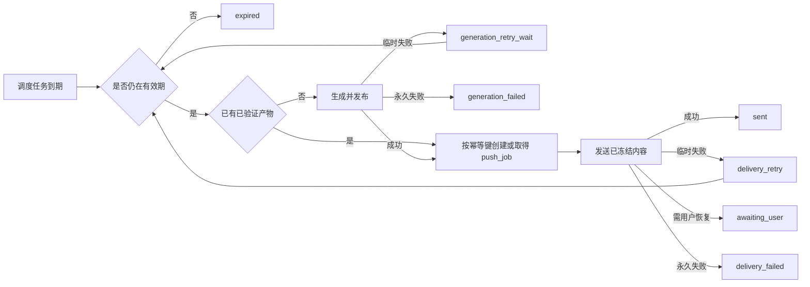

# 定时消息重试与有效期实施计划

> 状态：待实施  
> 适用范围：日复盘、周复盘、月复盘及已有 scheduler 推送链路  
> 决策目标：在消息仍对用户有用时尽力完成生成和送达；过期后停止自动补发，并保留可审计记录。

## 1. 结论

该需求可以实现，但不能只在现有推送队列上“多重试几次”。当前链路存在两个彼此独立的失败阶段：

1. **生成失败**：ACP 超时、模型或上游 API 异常发生在消息入队前，此时没有 `push_jobs`，现有发送重试无法恢复。
2. **送达失败**：内容已经生成并入队，但微信接口、网络或会话状态导致发送失败。此时应复用已保存的内容，禁止重新生成。

目标方案是在服务层建立“调度判定 → 内容生成/发布 → 推送入队 → 渠道送达”的可恢复状态链，并为每类消息设置业务有效期。每次执行先判断是否过期，再判断是否已经产生可复用产物，最后才决定重试生成还是重试发送。

首期不需要引入外部消息中间件，也不需要重写 scheduler。基于现有 SQLite、`scheduled_task_runs`、`push_jobs` 和 30 秒队列 worker 增量改造即可。后续只有在多节点吞吐或数据库竞争成为实际瓶颈时，才评估独立队列服务。

## 2. 用户价值与验收口径

### 2.1 用户故事

当一条计划内复盘因临时的 ACP/API 故障没有生成，或因微信接口临时故障没有送达时，系统应在内容仍有价值的时间内自动恢复。用户不应因一次短暂故障永久漏收，也不应在很久以后收到失去时效的旧复盘或一批集中补发。

### 2.2 成功标准

- 临时生成故障可在有效期内自动重试，成功后只产生一份逻辑报告和一个逻辑推送任务。
- 临时送达故障只重发已经冻结的消息，不再次调用 ACP，不改变内容。
- 到达有效期后，不再调用 ACP 或渠道 API，任务以 `expired` 终态保留。
- 会话过期、账号不匹配等需要外部恢复的错误不持续撞击渠道 API。
- 服务重启、worker 并发和“超时但实际已保存”均不产生重复报告或重复推送。
- 用户恢复会话后不会被多个旧消息集中轰炸。
- 平台审计页能区分“未生成、生成重试中、待发送、发送重试中、等待用户、已过期、永久失败、已送达”。

### 2.3 非目标

- 不保证所有第三方故障最终都能送达；超过业务有效期时以不打扰用户为优先。
- 不在首期建设任意业务通用的工作流编排平台。
- 不通过 Workspace Skill 或提示词承担重试、幂等、权限与审计保证。
- 不自动覆盖真实 Workspace 文件，不在测试中向真实微信用户发消息。
- 不自动补发本功能上线前的历史失败任务。

## 3. 现状与缺口

### 3.1 已有能力

`src/services/push-queue.ts` 已提供发送阶段的基础可靠性：

- 失败后按 1、2、5、10、30 分钟退避；默认最多尝试 5 次。
- worker 约每 30 秒处理到期任务。
- `processing` 有 2 分钟租约，可在进程中断后重新认领。
- 调度消息遇到 `context_expired` 会进入 `awaiting_user`，不再立即循环调用。
- 用户正在执行复杂任务时可延后 2 分钟，且当前不会增加发送尝试次数。
- `idempotency_key` 有唯一索引，可复用为逻辑推送去重基础。

`src/scheduler/review.ts` 已在计划发送前 10 分钟预生成复盘，日复盘通过 `reviews.save` 持久化，周/月复盘也会写入 Workspace 产物；`scheduled_task_runs` 可对同一任务键做跨进程一次性抢占。

### 3.2 关键缺口

| 链路 | 当前行为 | 后果 |
| --- | --- | --- |
| ACP/上游生成超时 | `scheduled_task_runs` 记为 `error`，同一 `task_key` 不能再次 claim | 内容尚未入队，发送重试无能为力 |
| 超时发生在保存之后 | 缺少产物引用和完成探测 | 盲目重试可能重复生成或发布 |
| 发送失败 | 仅按次数决定继续或 `dead` | 可能在内容失效后继续补发，也可能有效期内过早放弃 |
| 错误分类 | 除 `context_expired` 外大多走同一策略 | 永久错误被无效重试，临时错误缺少针对性策略 |
| 内容时效 | `push_jobs` 无 `expires_at` 和消息类型 | 无法执行“过期不打扰” |
| 全链路状态 | 生成记录和推送记录仅有弱关联 | 平台无法清楚解释消息卡在哪一阶段 |
| 恢复补发 | `awaiting_user` 可在用户恢复后取回，但无统一过期/合并规则 | 可能集中发送多条陈旧消息 |

## 4. 核心设计

### 4.1 分离两个重试状态机



两个状态机必须使用独立的 `attempts`、退避策略和错误分类。生成重试的成功出口是“产物已验证并取得唯一推送任务”；发送重试的输入永远是 `push_jobs.message` 中已经冻结的文本。

### 4.2 先检查产物，再重试生成

ACP 调用超时不等于生成逻辑必然没有完成。每次生成重试前必须执行产物探测：

1. 按确定性的逻辑任务键查 `scheduled_task_runs.artifact_ref`。
2. 日复盘检查对应 `reviews.save` 记录或其稳定标识；周/月复盘检查预期 Workspace 产物及必要校验信息。
3. 产物存在且通过最小完整性校验时，将逻辑任务推进到 `generated`，不再调用 ACP。
4. 只有确认产物不存在或不完整，且错误属于可重试、任务未过期时，才重新生成。

产物探测不能仅以“文件存在”为成功；至少校验目标用户/实例、复盘类型、业务日期和非空内容。若现有保存接口不能返回稳定引用，首期应为其补充返回值，而不是从自然语言文本猜测。

### 4.3 统一幂等键

每条逻辑消息采用稳定键：

```text
scheduled:{instance_id}:{user_id}:{message_kind}:{business_period}
```

其中 `business_period` 使用业务时区 `Asia/Shanghai` 下的交易日、周或月，不使用实际重试时间。建议：

- `scheduled:INSTANCE:USER:daily_review:2026-07-29`
- `scheduled:INSTANCE:USER:weekly_review:2026-W31`
- `scheduled:INSTANCE:USER:monthly_review:2026-07`
- 盘中窗口需追加稳定的窗口 ID，例如 `market_watch:2026-07-29T10:30+08:00`

同一逻辑键同时约束报告发布和推送入队。数据库唯一约束是最后防线，代码层的“先查再写”不能替代唯一约束。

### 4.4 有效期策略

有效期应由服务端按 `message_kind` 和原定发送时间计算，入队后冻结到 `expires_at`。重试次数和有效期是两个同时生效的上限：任一先到即停止。

以下是首轮评审默认值，不应在验证前散落硬编码到多个模块：

| 消息类型 | 建议有效期 | 过期后的处理 |
| --- | --- | --- |
| 规则即时提醒 | 10–30 分钟，或条件已失效时立即过期 | 标记 `expired`；不补发 |
| 盘中观察简报 | 下一计划窗口或当日收盘，取较早者 | 新窗口取代旧窗口；不连续补发 |
| 日复盘 | 下一交易日 08:30（北京时间） | 保留报告供查询；不主动推送 |
| 周复盘 | 下一交易日 09:00，且最长不超过 96 小时 | 保留报告供查询；不主动推送 |
| 月复盘 | 原定时间后 72 小时 | 保留报告供查询；不主动推送 |
| onboarding 完成通知 | 不按行情时效过期 | 进入等待用户/渠道恢复，不套用复盘策略 |

最终默认值需要产品负责人确认，尤其是节假日后的“下一交易日”算法。交易日相关截止时间必须使用现有交易日历能力；缺少可靠日历时应采用明确的保守降级并记录来源，不能把自然日静默当交易日。

### 4.5 错误分类

所有生成器和渠道适配器应返回结构化错误类别，日志字符串仅作诊断证据，不作为主要控制流。

| 类别 | 典型情况 | 动作 |
| --- | --- | --- |
| `transient` | ACP 超时、上游 429/5xx、网络异常、微信临时 API 错误 | 在有效期内退避重试 |
| `waiting_external` | `context_expired`、无近期会话、账号不匹配、会话失效 | 停止自动撞击 API，进入 `awaiting_user` 或运营处理 |
| `permanent` | 非法 payload、明确鉴权失败、配置缺失、内容无法序列化 | 立即终止并告警 |
| `expired` | 当前时间达到 `expires_at`，或新窗口已取代旧窗口 | 不调用外部服务，终态结束 |
| `unknown` | 未识别异常 | 小次数保守重试后终止并告警，不无限循环 |

错误映射应集中维护，并把原始错误码、脱敏错误摘要和分类依据写入审计字段。`ret=-2` 等供应商错误码需以当前渠道适配器的已验证语义为准，不能仅凭字符串做全局推断。

### 4.6 重试与防打扰

建议首期策略：

- 生成阶段最多 3 次实际 ACP 调用，退避 2、5、15 分钟，每次都先检查有效期和既有产物。
- 发送阶段保留当前 1、2、5、10、30 分钟退避和最多 5 次的默认策略，但每次 claim 前先检查 `expires_at`。
- 用户活跃导致的延后不计入尝试次数；等待用户状态也不消耗自动重试预算。
- 对相同用户恢复时的待发消息按消息类型去重：同一类型只保留最新仍有效的一条；已过期项只留记录。
- 单个用户设置恢复发送节流，例如每分钟最多一条调度消息；多个仍有效项目优先级为即时提醒、最新日复盘、周/月复盘。
- 若存在多条过期但值得用户知道的报告，只提供一条简短“历史报告可查看”入口，不能自动逐条补发。该摘要能力可放在第二阶段。

## 5. 持久化方案

重试状态属于服务层权威状态，继续放在 SQLite，不写入 Workspace 作为调度真相。迁移遵循增量、向后兼容原则，生产迁移仍以 `src/db/index.ts` 为权威路径，并同步 Drizzle schema。

### 5.1 `push_jobs` 增量字段

| 字段 | 建议类型 | 用途 |
| --- | --- | --- |
| `message_kind` | `TEXT` nullable | `daily_review`、`weekly_review` 等策略选择 |
| `expires_at` | `TEXT` nullable | ISO 8601 绝对截止时间；新调度消息必填 |
| `origin_task_key` | `TEXT` nullable | 关联逻辑生成任务 |
| `retry_policy` | `TEXT` nullable | 受控策略 ID，不存任意可执行配置 |
| `terminal_reason` | `TEXT` nullable | `expired`、`max_attempts`、`permanent_error` 等终态原因 |

状态增加 `expired`；是否把现有 `dead` 重命名为 `delivery_failed` 不在首期做破坏性迁移，可通过 `terminal_reason` 提供准确语义。为到期扫描补充合适索引前，应使用真实查询计划验证，避免无依据增加索引。

### 5.2 `scheduled_task_runs` 增量字段

| 字段 | 建议类型 | 用途 |
| --- | --- | --- |
| `attempts` | `INTEGER NOT NULL DEFAULT 0` | 实际生成调用次数 |
| `max_attempts` | `INTEGER NOT NULL DEFAULT 1` | 兼容旧行为；新策略创建时写入 3 |
| `next_retry_at` | `TEXT` nullable | 下次可认领时间 |
| `lease_expires_at` | `TEXT` nullable | worker 崩溃后的恢复边界 |
| `expires_at` | `TEXT` nullable | 逻辑消息有效期 |
| `error_class` | `TEXT` nullable | 结构化失败类别 |
| `artifact_ref` | `TEXT` nullable | 已验证产物的稳定引用 |

状态建议扩展为：`claimed`、`generating`、`generation_retry_wait`、`generated`、`success`、`skipped`、`error`、`expired`。现有读取方必须对新增状态容错。

### 5.3 是否新增尝试明细表

首期不建议强制新增表。当前 `weixin_delivery_attempts` 已记录渠道尝试；生成阶段先用任务行的累计字段、最新错误和 ACP trace 完成闭环。若评审确认需要逐次生成的不可变审计，再增加 `scheduled_task_attempts`，字段至少包含任务键、阶段、尝试序号、开始/结束时间、结果、错误类别和 trace 引用。

这项取舍的判断标准是审计需求，不是为了让状态表看起来更“完整”。

### 5.4 旧数据兼容

- 现有 `push_jobs.expires_at IS NULL` 维持旧行为，不对历史记录猜测有效期；新调度任务必须写入。
- 现有 `scheduled_task_runs` 默认 `max_attempts=1`，避免上线后意外重放历史任务。
- 不做历史失败任务自动 backfill。
- 表结构迁移前备份生产 SQLite；迁移后核对表、列、索引、行数及 scheduler 健康状态。
- 更新 `docs/table-ownership.md`，明确新增字段仍由 service/scheduler 所有。

## 6. 服务接口与执行流程

### 6.1 策略注册表

新增服务层的受控策略注册表，以 `message_kind` 查找：

- 有效期计算器；
- 生成和发送最大尝试次数；
- 退避序列；
- 是否可等待用户恢复；
- 同类消息的 supersede 规则；
- 恢复发送优先级。

调用方只传消息类型和业务时间，不允许 Workspace 或用户输入任意重试次数、截止时间或可执行策略。

### 6.2 生成 worker

将“只允许 insert 一次”的 `claimScheduledTaskRun` 扩展为带租约的条件认领：

1. 只认领新任务、到期的 `generation_retry_wait` 或租约已过期的 `generating`。
2. 原子更新状态和租约，保证两个 worker 只有一个获得执行权。
3. 认领后先判断有效期，再探测产物。
4. 调 ACP 前增加 `attempts`；结果按结构化错误分类推进状态。
5. 产物验证成功后，以稳定幂等键 enqueue，写回唯一 `push_job_id`。
6. 入队成功后才将逻辑任务标为 `success`；若进程在二者之间退出，下次凭幂等键恢复。

生成重试可以先复用 scheduler 的周期 tick 扫描到期任务，不必另起常驻进程。扫描频率应确保 2 分钟退避有实际意义。

### 6.3 发送 worker

在现有 `processDuePushJobs` 上增加以下顺序约束：

1. 查询到 due job 后，在调用 sender 之前原子 claim。
2. claim 条件和更新语句同时考虑状态、`next_retry_at` 与租约。
3. claim 后再次检查 `expires_at`；已到期直接写 `expired`，不增加 attempts。
4. 检查 supersede 状态和用户活跃情况；业务延后不增加 attempts。
5. 调用渠道并按结构化结果处理。
6. 计算的下次重试时间若不早于 `expires_at`，直接终止为 `expired`，不安排无效 timer。

### 6.4 手动恢复

平台可提供受权限和审计保护的单任务操作：

- “立即重试生成”：仅适用于未过期且错误可重试的任务。
- “立即重试发送”：仅适用于已有冻结内容、未过期且不是永久错误的任务。
- “标记终止”：运营确认不再发送。
- “仅查看/复制报告”：过期报告不重新推送。

首期可以先做只读观测和命令行运维入口，自动策略稳定后再开放 Platform 操作。任何手动动作都不能绕过 user/instance scope、过期规则和幂等约束。

## 7. 可观测性与告警

### 7.1 审计字段

每条逻辑任务至少可追踪：

- `task_key`、用户、实例、消息类型、原定时间、有效期；
- 当前阶段、状态、生成尝试数、发送尝试数；
- 最近错误类别和脱敏摘要；
- `artifact_ref`、`push_job_id`、ACP trace；
- 最终送达时间或终止原因。

日志统一带 `task_key` 和 `push_job_id`，避免依靠用户昵称或自然语言内容串联。日志不得输出完整敏感消息和认证信息。

### 7.2 指标与告警

至少提供：

- 按消息类型统计计划数、生成成功率、送达成功率、过期率；
- 生成/送达首次成功和最终成功的延迟分布；
- `generation_retry_wait`、`delivery_retry`、`awaiting_user`、`expired` 数量；
- 各错误类别和渠道错误码趋势；
- 租约恢复次数、幂等冲突次数、被新窗口取代次数。

告警应关注持续故障而非单次瞬时失败，例如 15 分钟窗口内同一阶段失败率超过阈值、到期积压持续增长、单实例连续多次生成失败。具体阈值在灰度期用真实基线确定。

## 8. 分阶段实施

### 阶段 0：契约确认与基线（0.5–1 天）

- 产品确认各消息类型有效期、恢复优先级和过期后的用户体验。
- 梳理当前生成错误、微信返回码和 ACP trace，形成错误映射表。
- 记录上线前一周的计划数、生成失败数、送达失败数及延迟，作为对比基线。
- 冻结首期范围：日/周/月复盘；盘中和规则提醒只复用通用字段，是否启用单独评审。

完成标准：策略表和错误映射有明确负责人；不存在“所有异常都重试”或“无限期补发”的未决口径。

### 阶段 1：有效期和发送阶段收敛（1–2 天）

- 为 `push_jobs` 增加消息类型、有效期、来源任务键、策略和终止原因。
- enqueue 时计算并冻结有效期；发送 worker 在外部调用前执行过期判断。
- 保留已有退避，加入结构化错误映射和 `expired` 终态。
- 为恢复补发增加同类型去重和单用户节流。
- Platform 审计查询展示新增字段和准确阶段。

完成标准：已生成消息能在有效期内重试，过期后零渠道调用，且不会恢复时批量轰炸。

### 阶段 2：生成阶段可恢复（2–4 天）

- 增量扩展 `scheduled_task_runs`，实现租约、尝试数、下次重试和有效期。
- 抽取统一的生成执行器和产物探测器。
- 日/周/月复盘接入稳定 artifact 引用和全链路幂等键。
- 增加 due generation 扫描，不改变现有调度配置来源。
- ACP 只对明确的临时错误自动重试。

完成标准：ACP 首次超时后可自动恢复；超时但产物已保存时不重复生成；重启与并发下只入队一次。

### 阶段 3：观测、灰度与运营恢复（1–2 天）

- 增加队列/任务指标、结构化日志和故障告警。
- 先对内部或测试实例启用，再按实例 allowlist 灰度。
- 提供受审计的单任务重试/终止操作，或形成等价的运维命令。
- 根据灰度数据调整退避和有效期，不扩大到旧历史任务。

完成标准：平台能回答“为什么没生成/没送达、还会不会重试、何时过期”；灰度期间无重复推送和过期推送。

### 阶段 4：扩展（按需）

- 评估盘中观察和规则提醒的条件失效检测。
- 增加过期报告的单条摘要入口。
- 当实际吞吐、锁竞争或多节点可靠性证明 SQLite 不足时，再评估外部队列。

## 9. 测试与验收矩阵

测试使用可控时钟、假 ACP 和假微信 sender，不依赖真实时间等待，不向真实用户发送。

| 场景 | 预期结果 |
| --- | --- |
| ACP 首次超时、第二次成功 | 到期后重试生成；只保存一份报告，只创建一个 push job |
| ACP 返回超时但 `reviews.save` 已成功 | 重试前探测到产物；不再次调用 ACP |
| 发送临时失败后成功 | 重发 `push_jobs.message`；ACP 调用次数不变 |
| 重试间隔跨过有效期 | 不安排或不执行下一次外部调用；状态为 `expired` |
| 日/周/月复盘同一故障 | 分别采用各自有效期，不共享错误的统一截止值 |
| 微信 `context_expired` | 一次失败后进入 `awaiting_user`；后台不重复撞击 API |
| 用户在有效期内恢复会话 | 只恢复最新、仍有效的适用消息，并受单用户节流约束 |
| 用户在过期后恢复会话 | 旧消息不主动发送；记录保留 |
| 两个 worker 同时扫描同一生成任务 | 只有一个取得租约并调用 ACP |
| 两个 worker 同时扫描同一 push job | 只有一个调用渠道 sender |
| worker 在 claim 后崩溃并重启 | 租约到期后可恢复；幂等键阻止重复发布/入队 |
| 用户活跃导致延后 | attempts 不增加；超过有效期后仍正确过期 |
| 新盘中窗口到来 | 旧窗口被 supersede，不连续补发 |
| 永久 payload/auth 错误 | 不退避重试；立即终止并告警 |
| 未识别错误 | 只做保守的小次数重试，随后终止并可审计 |
| 旧数据库升级 | 原行可读、不会自动重放；新字段和索引正确 |

工程验证命令：

```bash
npm test
npm run build
npm run smoke:stage1-scheduler
npm run smoke:stage2-watch-rules
npm run verify
```

其中 smoke 脚本必须使用隔离数据库和假 sender。真实火山云验收、真实微信发送和历史任务补发都需要单独明确授权。

## 10. 发布、回滚与数据安全

1. 先备份生产 SQLite，并记录备份文件校验和、数据库行数和当前 scheduler/push 指标。
2. 发布向后兼容 schema 与“双读兼容、只对新任务写新字段”的代码。
3. 只对测试实例启用过期判断和发送重试新策略，观察至少一个完整日复盘周期。
4. 再启用生成重试；按实例 allowlist 扩大，不一次性全量开启。
5. 回滚应用代码时保留新增 nullable 列，不做破坏性降级；旧代码应能忽略新增状态/字段。
6. 若出现重复推送、过期推送或异常积压，立即关闭功能开关，保留任务和审计数据供排查，不删除生产记录。

发布不得替换生产 `.env`、SQLite、真实 Workspace、`reviews/`、`.state/` 或微信状态。普通代码发布和真实 Workspace 变更必须继续分开处理。

## 11. 风险与待确认决策

| 决策 | 建议 | 负责人 |
| --- | --- | --- |
| 日复盘截止时间 | 下一交易日 08:30，北京时间 | 产品确认 |
| 周复盘截止时间 | 下一交易日 09:00，且最长 96 小时 | 产品确认 |
| 月复盘截止时间 | 原定时间后 72 小时 | 产品确认 |
| 用户恢复后的旧报告 | 只发最新仍有效项；过期项仅供查询 | 产品确认 |
| 交易日历不可用时 | 保守使用配置截止值并明确记录降级，不无限延长 | 产品 + 数据负责人 |
| 生成错误映射 | ACP/provider 返回结构化类别，unknown 有小次数上限 | 后端负责人 |
| 是否建生成尝试明细表 | 首期不建，审计需求证明必要后再加 | 后端 + 运维 |

最大技术风险不是重试算法，而是“ACP 超时但副作用已经完成”的不确定性。只有稳定产物引用、发布幂等和重试前探测同时成立，生成重试才可开启。若这三项未完成，首期应只上线发送有效期和发送重试收敛，不应自动重跑 ACP。

## 12. 任务拆分建议

| 工作包 | 主要产物 | 前置依赖 |
| --- | --- | --- |
| R1 策略与错误契约 | 消息策略注册表、错误分类映射、产品确认记录 | 无 |
| R2 数据迁移 | schema、`src/db/index.ts` 增量迁移、所有权文档、迁移测试 | R1 |
| R3 发送可靠性 | 过期判断、结构化失败、节流/supersede、单测 | R1、R2 |
| R4 产物幂等 | 稳定 artifact 引用、产物探测、发布去重 | R1 |
| R5 生成可靠性 | 带租约 claim、generation worker、退避和重启恢复 | R2、R4 |
| R6 审计与运营 | Platform 状态、指标、告警、受控恢复入口 | R2、R3、R5 |
| R7 灰度验收 | 隔离环境故障注入、生产 allowlist、回滚演练 | R3、R5、R6 |

建议交付顺序为 R1 → R2 → R3 与 R4 并行 → R5 → R6 → R7。R3 可独立创造价值，也是在生成重试尚未满足幂等前可安全上线的最小版本。
